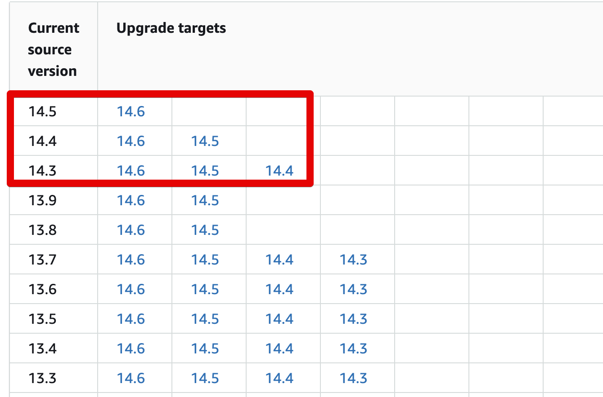
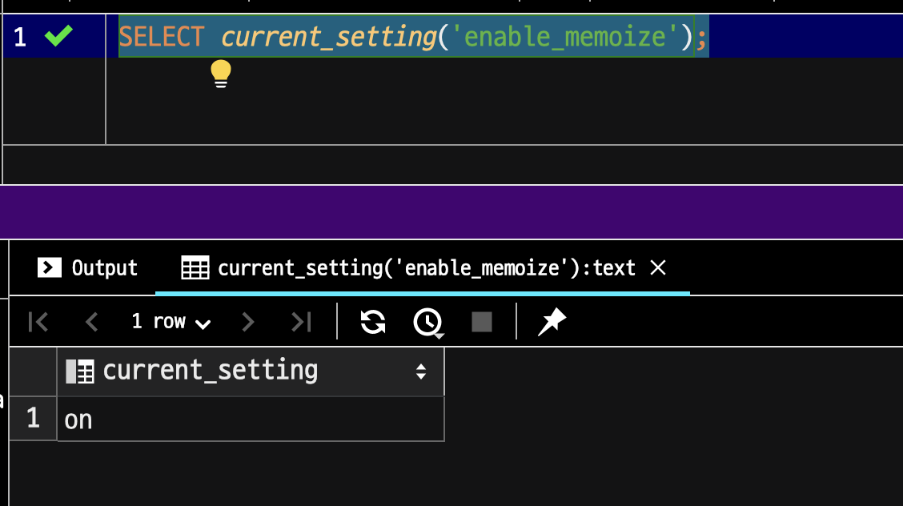
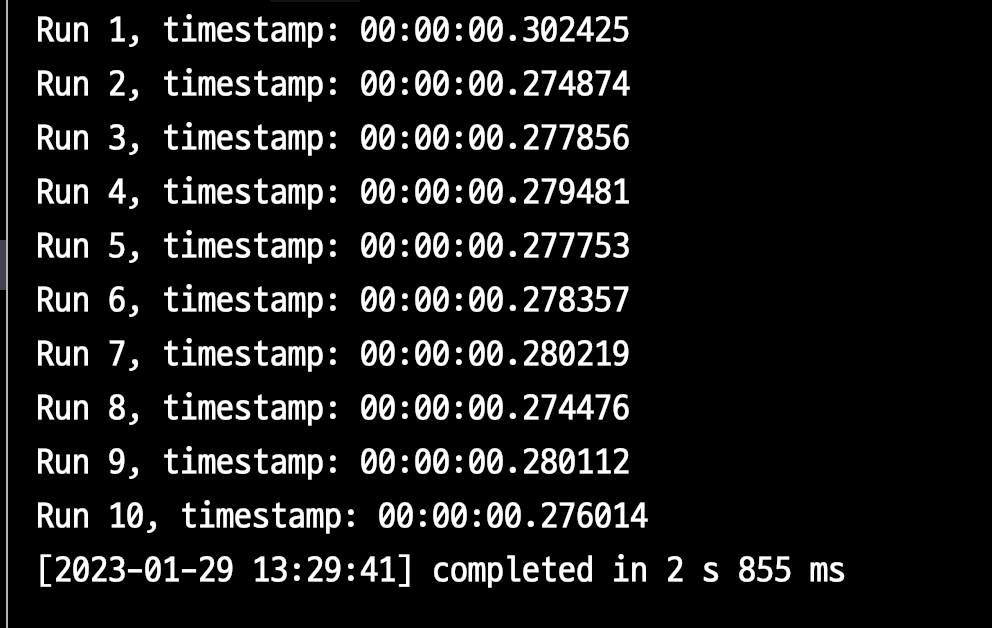
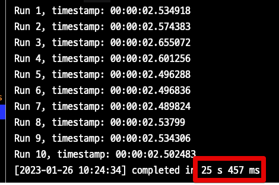

# PostgreSQL (Aurora) 13 vs 14 Nested Loop Join 성능 비교





> Amazon Aurora (RDS) 에서 파라미터가 Boolean이면 1 (ON) or 0 (OFF) 으로 설정한다.


## enable_memoize

```sql
SELECT current_setting('enable_memoize');
```




## 실험

```sql
CREATE TABLE team AS
SELECT team_no, team_no % 5 AS department_no
FROM generate_series(1, 100000) AS team_no;

CREATE TABLE users AS
SELECT user_no, user_no % 20000 as department_no
FROM generate_series(1, 100000) AS user_no;

CREATE INDEX idx_user_department_no ON users (department_no);
```


```sql
EXPLAIN analyze
SELECT *
FROM team JOIN users ON team.department_no = users.department_no;
```


```sql
DO $$
DECLARE
  v_ts TIMESTAMP;
  v_repeat CONSTANT INT := 25;
  rec RECORD;
BEGIN

  FOR r IN 1..10 LOOP
    v_ts := clock_timestamp();

    FOR i IN 1..v_repeat LOOP
      FOR rec IN (
        SELECT team.*
        FROM team JOIN users u2 on team.department_no = u2.department_no
      ) LOOP
        NULL;
      END LOOP;
    END LOOP;

    RAISE INFO 'Run %, timestamp: %', r, (clock_timestamp() - v_ts);
  END LOOP;
END$$;
```


### PG 13




### PG 14

