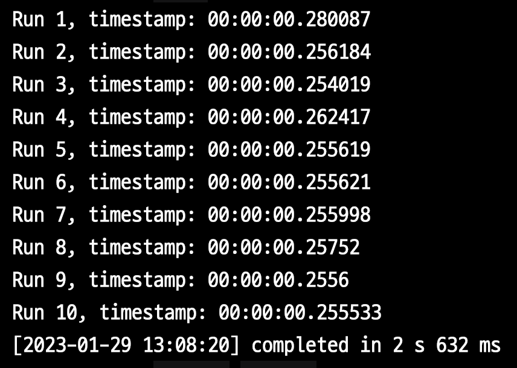

# PostgreSQL14 Memoize (13 vs 14 Nested Loop Join 성능 비교)

PostgreSQL에서는 3가지의 Join을 지원한다.

- Nested loop join
- Hash join
- Merge join

Join 테이블 중 하나라도 행이 적은 경우 Nested loop join이 주로 적용된다.  
Nested loop join 은 조인 조건이 동일 연산자를 사용하지 않는 경우에도 유일한 옵션으로 사용된다.

동일한 매개변수를 사용하여 내부 집합 행을 반복적으로 스캔하고 (결과적으로) 매번 동일한 결과를 얻는다면 더 빠른 액세스를 위해 행을 캐시하는 것이 좋다.

PostgreSQL 14에서는 [memoize](https://postgresqlco.nf/doc/en/param/enable_memoize/) 의 도입으로 가능해졌다.  
  
그리고 AWS의 Aurora PostgreSQL 역시 PostgreSQL 14.x를 지원하고 있어 해당 옵션을 사용할 수 있다.


### enable_memoize

```sql
SELECT current_setting('enable_memoize');
```


> Amazon Aurora (RDS) 에서 파라미터가 Boolean이면 1 (ON) or 0 (OFF) 으로 설정한다.


## 성능 테스트

```sql
CREATE TABLE team AS
SELECT team_no, team_no % 100 AS department_no
FROM generate_series(1, 10000) AS team_no;

CREATE TABLE users AS
SELECT user_no, user_no % 20000 as department_no
FROM generate_series(1, 5000000) AS user_no;

CREATE INDEX idx_user_department_no ON users (department_no);
```

- `team`
  - 10,000 row (1만건)
  - 1 ~ 100개의 `department_no`
- `users`
  - 5,000,000 row (500만건)
  - 1 ~ 20,000 개의 `department_no`
  - Join 성능 향상을 위한 index (`department_no`)

위와 같이 테이블을 생성 한 뒤, 이제 실험을 진행한다.

성능 테스트에 사용할 쿼리는 다음과 같다.

```sql
SELECT *
FROM team JOIN users on team.department_no = users.department_no
where team.department_no between 51 and 90;
```

해당 쿼리는 

- `team.department_no between 51 and 90` 는 `seq` 로 탐색하고
  - 총 **40개**의 team을 탐색한다.
- `team.department_no = users.department_no` 는 `index` 로 탐색한다.


성능 테스트를 위해 아래와 같이 반복문으로 **총 10번의 쿼리를 수행하고, 총 수행시간**을 합산한다.

```sql
DO $$
DECLARE
  v_ts TIMESTAMP;
  rec RECORD;
BEGIN

  FOR r IN 1..10 LOOP
    v_ts := clock_timestamp();

      FOR rec IN (
        SELECT *
        FROM team JOIN users on team.department_no = users.department_no
        where team.department_no between 51 and 90
      ) LOOP
        NULL;
      END LOOP;

    RAISE INFO 'Run %, timestamp: %', r, (clock_timestamp() - v_ts);
  END LOOP;
END$$;
```


### PG 13

PG 13에서는 다음과 같은 실행 계획을 가진다.

그리고 실행 결과는 


- 1회 평균 `285ms` 
- 10회 총합은 `2.855s` 이다.

### PG 14

PG 14는 2가지 종류로 진행된다.

- `enable_memoize` 를 `ON` 한 경우
- `enable_memoize` 를 `OFF` 한 경우

#### enable_memoize ON



- 1회 평균 `263ms` 
- 10회 총합은 `2.632s` 이다.

#### enable_memoize OFF


- 1회 평균 `281ms` 
- 10회 총합은 `2.814s` 이다.

PG13에서 14로 업데이트후, `enable_memoize` 이 도입됨으로 **Nested Loop Join은 10%의 성능 개선**이 되었다.  
(285ms -> 263ms)
  
그럼 왜 `enable_memoize` 이 도입됨으로서 이렇게 실행 계획 변경과 성능 개선이 이루어진 것일까?

## Memoization (Row caching)

캐시키 목록의 한쪽 끝에는 "콜드" 키(한동안 사용되지 않음)가 저장되고 다른 쪽 끝에는 "핫" 키(최근에 사용됨)가 저장된다.

Memoize 노드가 호출될 때마다 전달된 매개변수 값에 해당하는 행이 이미 캐시되었는지 확인한다.  
그렇다면 Memoize는 자식 노드를 호출하지 않고 부모 노드(Nested Loop)로 반환한다.  
또한 캐시 키를 키 목록의 핫 엔드에 넣는다.

필요한 행이 아직 캐시되지 않은 경우 Memoize는 자식 노드에서 행을 요청하고 캐시한 다음 위쪽으로 전달한다.  
새 캐시 키도 목록의 핫 엔드에 배치된다.

캐시가 가득 차면 할당된 메모리가 부족할 수 있습니다. 그런 일이 발생하면 Memoize는 목록에서 가장 차가운 항목을 제거하여 공간을 확보한다.  
알고리즘은 버퍼 캐시에서 사용되는 알고리즘과 다르지만 동일한 목표를 제공한다.

매개변수가 너무 많은 행과 일치하여 다른 모든 항목이 제거되더라도 캐시에 들어갈 수 없는 경우 매개변수의 행은 단순히 캐시되지 않는다.  
다음 번에 매개변수가 나타날 때 Memoize가 전체 출력을 얻기 위해 하위 노드를 호출해야 하기 때문에 부분 출력을 캐싱하는 것은 의미가 없다.


위에서 실험한 쿼리의 실행 계획을 살펴보자.


- Cache Key는 `team.department_no`
- 총 4000번의 탐색 중
  - Cache Misses: 40
  - Cache Hits: 3960
  - 이는 40개의 team을 탐색하면서 첫번째 호출에는 캐시되지 않지만 (`Misses: 40`), 이후 모든 반복 호출건 (`Cache Hits: 3960`) 은 모두 캐시처리 되었다. 
  - 캐시는 총 394kb를 차지했다.

여기서 `Evictions` 과 `Overflows` 를 보자. 

- `Evictions`
  - 캐시에서 **제거된 횟수**
- `Overflows`
  - **메모리 오버플로** 횟수

이 2가지 값이 0이 아닌 경우는 **할당된 캐시 크기가 충분하지 않음**을 나타낸다.  
이는 가능한 매개변수 값의 추정치가 올바르지 않을 때 자주 발생한다.  
이 경우 Memoize을 사용하는 것이 많은 리소스를 차지한다는 것을 의미할 수 있다.  
이럴 경우 최후의 수단으로 `enable_memoize` 를 `off` 로 설정하여 캐시 사용을 비활성화할 수 있다.


## 마무리

노드를 원하는 유일한 이유는 이 비용을 줄이기 위해서이다. 
"실제" 노드 비용은 계획에 나열되지 않은 반복 스캔 비용이다.

Memoize 노드의 반복 스캔 비용은 사용 가능한 메모리 양과 캐시에 액세스하는 방식에 따라 다르다.  

또한 내부 세트 스캔 수를 결정하는 예상 고유 매개변수 값의 수에 따라 크게 달라진다.  
이러한 모든 변수를 사용하여 캐시에서 주어진 행을 찾을 확률과 캐시에서 주어진 행을 제거할 확률을 계산할 수 있다.  
첫 번째 값은 예상 비용을 감소시키고 다른 값은 증가시킵니다.