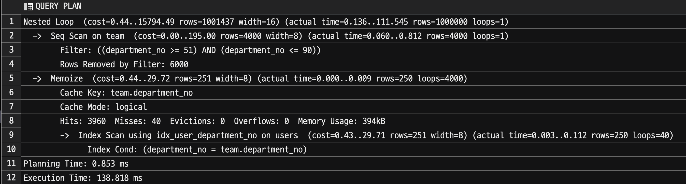

# PostgreSQL14 Memoize (13 vs 14 Nested Loop Join 성능 비교)

PostgreSQL에서는 3가지의 Join 알고리즘을 지원한다.

- Nested loop join
- Hash join
- Merge join

이 중 Nested loop join 은 가장 보편적인 Join 방식으로 그 작동 방식에는 결국 반복적인 스캔이 있다.  

만약 반복적인 스캔의 하위 결과가 매번 같다면 이를 **캐시해두고 반복적인 스캔에서 계속 사용**한다면 어떨까?    
  
PostgreSQL 14에서는 [memoize](https://postgresqlco.nf/doc/en/param/enable_memoize/) 의 도입으로 가능해졌다.  
  
그리고 AWS의 Aurora PostgreSQL 역시 PostgreSQL 14.x를 지원하고 있어 해당 옵션을 사용할 수 있다.


이번엔 해당 옵션으로 인한 성능 개선을 알아보자.

## 성능 테스트

성능 테스트 전에 먼저 본인의 PostgreSQL DB가 해당 기능을 지원하는지 체크한다.

### enable_memoize

아래 쿼리로 현재 설정을 확인할 수 있다.

```sql
SELECT current_setting('enable_memoize');
```


PG 14에서는 `enable_memoize` 의 **기본 옵션이 ON**이다.  
그래서 별도의 설정 없이도 memoize 가 적용된다.   
  
AWS Aurora PostgreSQL을 사용한다면 다음과 같이 파라미터 그룹에서 확인할 수 있다.


> Amazon Aurora (RDS) 에서 파라미터가 Boolean이면 1 (ON) or 0 (OFF) 으로 설정한다.


### 테스트

테스트를 위해 다음의 환경을 13버전과 14버전에서 각각 만들어둔다.

```sql
CREATE TABLE team AS
SELECT team_no, team_no % 100 AS department_no
FROM generate_series(1, 50000) AS team_no;

CREATE TABLE users AS
SELECT user_no, user_no % 20000 as department_no, now() as created_at
FROM generate_series(1, 5000000) AS user_no;

CREATE INDEX idx_user_department_no ON users (department_no);
```

- `team`
  - 50,000 row (5만건)
  - 1 ~ 100 사이의 `department_no`
- `users`
  - 5,000,000 row (500만건)
  - 1 ~ 20,000 사이의 `department_no`
  - Join 성능 향상을 위한 index (`department_no`)

위와 같이 테이블을 생성 한 뒤, 이제 실험을 진행한다.

성능 테스트에 사용할 쿼리는 다음과 같다.

```sql
SELECT *
FROM team JOIN users on team.department_no = users.department_no
where team.department_no between 51 and 90;
```

해당 쿼리는 

- `team.department_no between 51 and 90` 는 `seq` 로 탐색하고
  - 총 **40개**의 team을 탐색한다.
- `team.department_no = users.department_no` 는 `index` 로 탐색한다.


성능 테스트를 위해 아래와 같이 반복문으로 **총 10번의 쿼리를 수행하고, 총 수행시간**을 합산한다.

```sql
DO $$
DECLARE
  v_ts TIMESTAMP;
  rec RECORD;
BEGIN

  FOR r IN 1..10 LOOP
    v_ts := clock_timestamp();

      FOR rec IN (
        SELECT *
        FROM team JOIN users on team.department_no = users.department_no
        where team.department_no between 51 and 90
      ) LOOP
        NULL;
      END LOOP;

    RAISE INFO 'Run %, timestamp: %', r, (clock_timestamp() - v_ts);
  END LOOP;
END$$;
```

### PG 13

PG 13에서는 다음과 같은 실행 계획을 가진다.


그리고 실행 결과는 


- 1회 평균 `285ms` 
- 10회 총합은 `2.855s` 이다.

### PG 14

PG 14는 2가지 종류로 진행된다.

- `enable_memoize` 를 `ON` 한 경우
- `enable_memoize` 를 `OFF` 한 경우

#### enable_memoize ON

실행계획은 다음과 같다.



13버전과 달리 **Nested Loop**가 적용된다.


- 1회 평균 `263ms` 
- 10회 총합은 `2.632s` 이다.

#### enable_memoize OFF

만약 똑같이 PG 14 버전을 사용하지만 **enable_memoize을 off한다면** 어떻게 될까?


- 1회 평균 `281ms` 
- 10회 총합은 `2.814s` 이다.

PG14라 하더라도 해당 옵션을 `off` 할 경우 PG 13과 거의 비슷한 성능 결과를 냈다.

### 테스트 결과

PG13에서 14로 업데이트후, `enable_memoize` 이 도입됨으로 **Nested Loop Join은 10%의 성능 개선**이 되었다.  
(285ms -> 263ms)
  
그럼 왜 `enable_memoize` 이 도입됨으로서 이렇게 실행 계획 변경과 성능 개선이 이루어진 것일까?

## Memoization (Row caching)

캐시키 목록의 한쪽 끝에는 "콜드" 키(한동안 사용되지 않음)가 저장되고 다른 쪽 끝에는 "핫" 키(최근에 사용됨)가 저장된다.

Memoize 노드가 호출될 때마다 전달된 매개변수 값에 해당하는 행이 이미 캐시되었는지 확인한다.  
그렇다면 Memoize는 자식 노드를 호출하지 않고 부모 노드(Nested Loop)로 반환한다.  
또한 캐시 키를 키 목록의 핫 엔드에 넣는다.

필요한 행이 아직 캐시되지 않은 경우 Memoize는 자식 노드에서 행을 요청하고 캐시한 다음 위쪽으로 전달한다.  
새 캐시 키도 목록의 핫 엔드에 배치된다.

캐시가 가득 차면 할당된 메모리가 부족할 수 있습니다. 그런 일이 발생하면 Memoize는 목록에서 가장 차가운 항목을 제거하여 공간을 확보한다.  
알고리즘은 버퍼 캐시에서 사용되는 알고리즘과 다르지만 동일한 목표를 제공한다.

매개변수가 너무 많은 행과 일치하여 다른 모든 항목이 제거되더라도 캐시에 들어갈 수 없는 경우 매개변수의 행은 단순히 캐시되지 않는다.  
다음 번에 매개변수가 나타날 때 Memoize가 전체 출력을 얻기 위해 하위 노드를 호출해야 하기 때문에 부분 출력을 캐싱하는 것은 의미가 없다.


위에서 실험한 쿼리의 실행 계획을 살펴보자.


- Cache Key는 `team.department_no`
- 총 4000번의 탐색 중
  - Cache Misses: 40
  - Cache Hits: 3960
  - 이는 40개의 team을 탐색하면서 첫번째 호출에는 캐시되지 않지만 (`Misses: 40`), 이후 모든 반복 호출건 (`Cache Hits: 3960`) 은 모두 캐시처리 되었다. 
  - 캐시는 총 394kb를 차지했다.

여기서 `Evictions` 과 `Overflows` 를 보자. 

- `Evictions`
  - 캐시에서 **제거된 횟수**
- `Overflows`
  - **메모리 오버플로** 횟수

이 2가지 값이 0이 아닌 경우는 **할당된 캐시 크기가 충분하지 않음**을 나타낸다.  
이는 가능한 매개변수 값의 추정치가 올바르지 않을 때 자주 발생한다.  
이 경우 Memoize을 사용하는 것이 많은 리소스를 차지한다는 것을 의미할 수 있다.  
이럴 경우 최후의 수단으로 `enable_memoize` 를 `off` 로 설정하여 캐시 사용을 비활성화할 수 있다.


## lateral 성능 테스트

위 실험을 하다보면 [lateral](https://www.heap.io/blog/postgresqls-powerful-new-join-type-lateral) 은 얼마나 성능 개선이 될지 궁금해진다.  
Sub Query 간 상호 참조가 가능한 `lateral` 은 Cache 효율이 굉장히 잘 나올것 같다.

> `lateral` 에 대해선 다음에 좀 더 자세히 정리할 예정이다.
  
다음의 쿼리로 13, 14버전에서 테스트해보자.

```sql
select *
from (select team_no, department_no 
    from team 
    where team_no between 50 and 40000) t,
lateral (
    select user_no
    from users
    where t.department_no = users.department_no
    ) u
```

이를 각 10회 수행한다.

### lateral PG 13


### lateral PG 14


- 전체 반복 횟수: 39,951
  - `loops: 39951` 
- 


테스트 결과 `lateral` 에서는 약 20%의 성능 개선이 있었다.  
다만, **loop의 횟수가 많을수록 이 개선은 더 효과를 본다**.  
현재는 약 3~4만회의 횟수를 반복하기 때문에 20%의 차이이지,  
만약 수십만 loop가 필요한 경우에는 이보다 훨씬 더 효과를 볼 수 있을것 같다.


(출처: [트위터](https://twitter.com/RPorsager/status/1455660236375826436))

## 마무리

노드를 원하는 유일한 이유는 이 비용을 줄이기 위해서이다. 
"실제" 노드 비용은 계획에 나열되지 않은 반복 스캔 비용이다.

Memoize 노드의 반복 스캔 비용은 사용 가능한 메모리 양과 캐시에 액세스하는 방식에 따라 다르다.  

또한 내부 세트 스캔 수를 결정하는 예상 고유 매개변수 값의 수에 따라 크게 달라진다.  
이러한 모든 변수를 사용하여 캐시에서 주어진 행을 찾을 확률과 캐시에서 주어진 행을 제거할 확률을 계산할 수 있다.  
첫 번째 값은 예상 비용을 감소시키고 다른 값은 증가시킵니다.