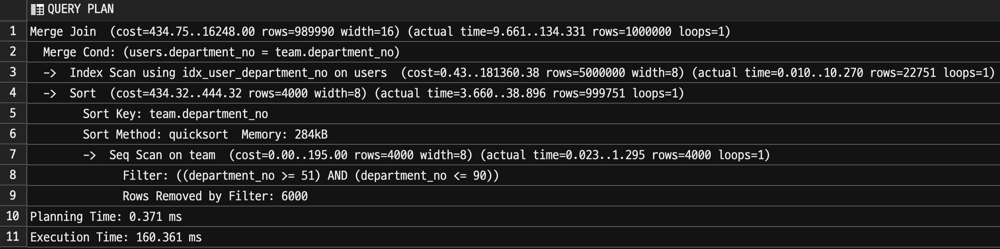
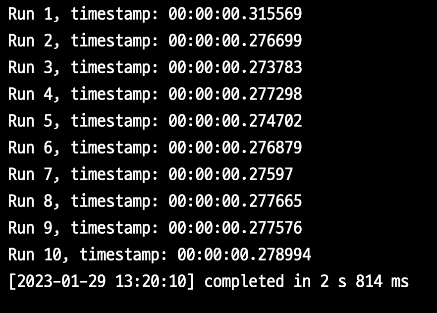
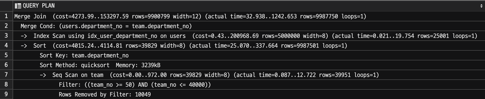
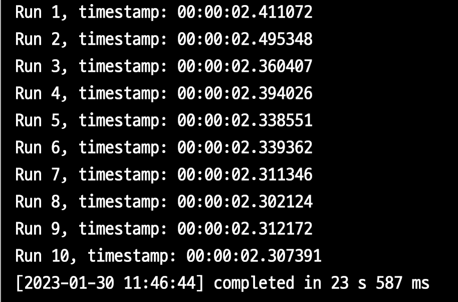
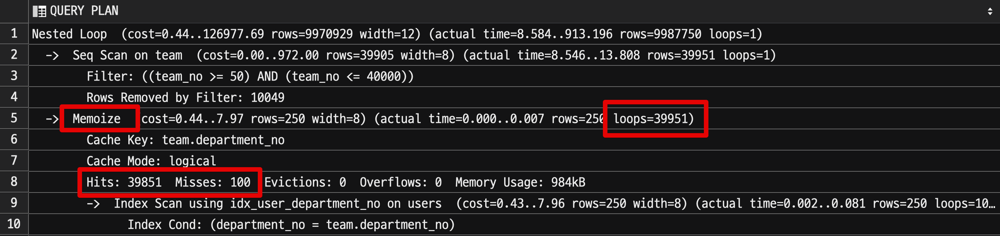
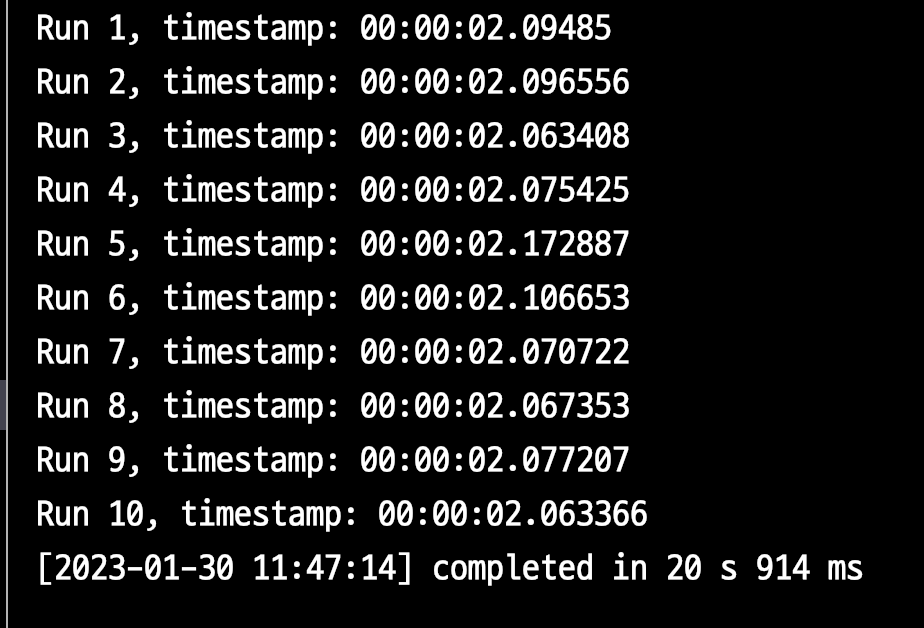

# PostgreSQL14 Memoize (13 vs 14 Nested Loop Join 성능 비교)

PostgreSQL에서는 3가지의 Join 알고리즘을 지원한다.

- Nested loop join
- Hash join
- Merge join

이 중 Nested loop join 은 가장 보편적인 Join 방식으로 그 작동 방식에는 결국 **반복적인 스캔**이 있다.  

만약 반복적인 스캔의 하위 결과가 매번 같다면 이를 **캐시해두고 반복적인 스캔에서 계속 사용**한다면 어떨까?  
아마도 [JavaScript의 메모이제이션](https://www.devh.kr/2020/Understanding-Memoization-In-JavaScript/) 을 알고 있다면 이해하기 쉬울것 같다.  
  
PostgreSQL 14에서 
[memoize](https://postgresqlco.nf/doc/en/param/enable_memoize/) 이 도입되었다.    

그리고 AWS의 Aurora PostgreSQL 역시 PostgreSQL 14.x를 지원하고 있어 해당 옵션을 사용할 수 있다.


Memoize 로 성능 개선을 얼마나 얻을 수 있을지 한번 알아보자.

## 1. 성능 테스트

성능 테스트 전에 먼저 본인의 PostgreSQL DB가 해당 기능을 지원하는지 체크한다.

### 1-1. enable_memoize

아래 쿼리로 현재 설정을 확인할 수 있다.

```sql
SELECT current_setting('enable_memoize');
```


PG 14에서는 `enable_memoize` 의 **기본 옵션이 ON**이다.  
그래서 별도의 설정 없이도 memoize 가 적용된다.   
  
AWS Aurora PostgreSQL을 사용한다면 다음과 같이 파라미터 그룹에서 확인할 수 있다.


> Amazon Aurora (RDS) 에서 파라미터가 Boolean이면 1 (ON) or 0 (OFF) 으로 설정한다.


### 1-2. 테스트

테스트를 위해 다음의 환경을 13버전과 14버전에서 각각 만들어둔다.

```sql
CREATE TABLE team AS
SELECT team_no, team_no % 100 AS department_no
FROM generate_series(1, 50000) AS team_no;

CREATE TABLE users AS
SELECT user_no, user_no % 20000 as department_no, now() as created_at
FROM generate_series(1, 5000000) AS user_no;

CREATE INDEX idx_user_department_no ON users (department_no);
```

- `team`
  - 50,000 row (5만건)
  - 1 ~ 100 사이의 `department_no`
- `users`
  - 5,000,000 row (500만건)
  - 1 ~ 20,000 사이의 `department_no`
  - Join 성능 향상을 위한 index (`department_no`)

위와 같이 테이블을 생성 한 뒤, 이제 실험을 진행한다.

성능 테스트에 사용할 쿼리는 다음과 같다.

```sql
SELECT *
FROM team JOIN users on team.department_no = users.department_no
where team.department_no between 51 and 90;
```

해당 쿼리는 

- `team.department_no between 51 and 90` 는 `seq` 로 탐색하고
  - 총 **40개**의 team을 탐색한다.
- `team.department_no = users.department_no` 는 `index` 로 탐색한다.


성능 테스트를 위해 아래와 같이 반복문으로 **총 10번의 쿼리를 수행하고, 총 수행시간**을 합산한다.

```sql
DO $$
DECLARE
  v_ts TIMESTAMP;
  rec RECORD;
BEGIN

  FOR r IN 1..10 LOOP
    v_ts := clock_timestamp();

      FOR rec IN (
        SELECT *
        FROM team JOIN users on team.department_no = users.department_no
        where team.department_no between 51 and 90
      ) LOOP
        NULL;
      END LOOP;

    RAISE INFO 'Run %, timestamp: %', r, (clock_timestamp() - v_ts);
  END LOOP;
END$$;
```

### 1-3. PG 13

PG 13에서는 다음과 같은 실행 계획을 가진다.



그리고 실행 결과는 


- 1회 평균 `285ms` 
- 10회 총합은 `2.855s` 이다.

### 1-4. PG 14

PG 14는 2가지 종류로 진행된다.

- `enable_memoize` 를 `ON` 한 경우
- `enable_memoize` 를 `OFF` 한 경우

#### enable_memoize ON

실행계획은 다음과 같다.


13버전과 달리 **Nested Loop**가 적용된다.


- 1회 평균 `263ms` 
- 10회 총합은 `2.632s` 이다.

#### enable_memoize OFF

만약 똑같이 PG 14 버전을 사용하지만 **enable_memoize을 off한다면** 어떻게 될까?



- 1회 평균 `281ms` 
- 10회 총합은 `2.814s` 이다.

PG14라 하더라도 해당 옵션을 `off` 할 경우 PG 13과 거의 비슷한 성능 결과를 냈다.

### 1-5. 테스트 결과

PG13에서 14로 업데이트후, `enable_memoize` 이 도입됨으로 **Nested Loop Join은 10%의 성능 개선**이 되었다.  
(285ms -> 263ms)
  
memoize로 성능 개선이 된 것을 확인하였으니, 좀 더 자세히 알아보자.

## 2. Memoization (Row caching)

PostgreSQL에서는 memoize 가 활성화 된 경우, Memoize 노드가 호출될 때마다 전달된 매개변수 값에 해당하는 Row가 이미 캐시되었는지 확인한다.  
해당 Row가 **캐시되어있으면 즉시 하위 테이블 (혹은 서브 쿼리)의 스캔을 건너뛰고**, 다시 부모 노드 (Nested Loop) 로 반환한다.  
  
캐시이기 때문에 당연히 메모리를 차지하는 양이 계속 증가할 수 있다.  
그래서 신규 캐시 데이터가 생성될때 남은 캐시 공간이 부족할 경우 **자주 조회되지 않는 캐시 데이터를 제거**하여 공간을 확보한다.  
물론 매개변수가 너무 많은 row와 일치해서 **기존 캐시 항목을 제거되더라도 캐시에 들어갈 수 없는 경우 매개변수의 row는 캐시되지 않는다**.  
  

위에서 실험한 쿼리의 실행 계획을 살펴보자.


- Cache Key는 `team.department_no`
- 총 4000번의 탐색 중
  - Cache Misses: 40
  - Cache Hits: 3960
  - 이는 40개의 team을 탐색하면서 첫번째 호출에는 캐시되지 않지만 (`Misses: 40`), 이후 모든 반복 호출건 (`Cache Hits: 3960`) 은 모두 캐시처리 되었다. 
  - 캐시는 총 394kb를 차지했다.

여기서 `Evictions` 과 `Overflows` 를 보자. 

- `Evictions`
  - 캐시에서 **제거된 횟수**
- `Overflows`
  - **메모리 오버플로** 횟수

이 2가지 값이 0이 아닌 경우는 **할당된 캐시 크기가 충분하지 않음**을 나타낸다.  
이는 가능한 매개변수 값의 추정치가 올바르지 않을 때 자주 발생한다.  
이 경우 Memoize을 사용하는 것이 많은 리소스를 차지한다는 것을 의미할 수 있다.  
이럴 경우 최후의 수단으로 `enable_memoize` 를 `off` 로 설정하여 캐시 사용을 비활성화할 수 있다.

## 3. lateral 성능 테스트

위 실험을 하다보면 [lateral](https://www.heap.io/blog/postgresqls-powerful-new-join-type-lateral) 은 얼마나 성능 개선이 될지 궁금해진다.  
Sub Query 간 상호 참조가 가능한 `lateral` 은 Cache 효율이 굉장히 잘 나올것 같다.

> `lateral` 에 대해선 다음에 좀 더 자세히 정리할 예정이다.
  
다음의 쿼리로 13, 14버전에서 테스트해보자.

```sql
select *
from (select team_no, department_no 
    from team 
    where team_no between 50 and 40000) t,
lateral (
    select user_no
    from users
    where t.department_no = users.department_no
    ) u
```

이를 각 10회 수행한다.

### 3-1. lateral PG 13

실행 계획은 다음과 같다.



memoize 가 지원되지 않는 13버전에서는 Nested Loop가 적용되지 않는다.



- 1회 평균 `2.358s` 
- 10회 총합은 `23.587s` 이다.

### 3-2. lateral PG 14



- 전체 반복 횟수: 39,951
  - `loops`: 39,951 
  - `Cache Misses`: 100 
  - `Cache Hits`: 39,851



- 1회 평균 `2.09s` 
- 10회 총합은 `20.914s` 이다.

테스트 결과 `lateral` 에서는 약 **20%의 성능 개선**이 있었다.  
다만, 이게 memoize가 적용된 `lateral`의 전체적인 성능 개선이라고 보기는 어렵다.  
memoize의 특성상 **loop 횟수가 많을수록 그 효율이 극대화된다**.  
현재는 약 3~4만회의 횟수를 반복하기 때문에 20%의 차이이지,  
만약 **수십만 loop가 실행된 경우에는 이보다 훨씬 더 효과**를 볼 수 있을것 같다.


(1000배의 성능 개선이 되었다는 [트위터 짤](https://twitter.com/RPorsager/status/1455660236375826436)...)

## 4. 마무리

매개변수가 같다면 몇번을 실행해도 함수의 결과가 동일함이 보장됨에도 우리는 매번 함수 연산을 수행할 때가 있다.  
그간 PostgreSQL 의 Nested Loop가 그러했다.  
14버전부터 Memoize가 지원되니 이제는 그런 불필요한 연산을 계속 할 필요가 없다.  
실행 계획에서 Nested Loop 가 빈번하며, 그 성능도 만족스럽지 않다면, 14 로 업데이트하여 Memoize로 성능 개선 효과를 한번 시험해봐도 좋을것 같다.