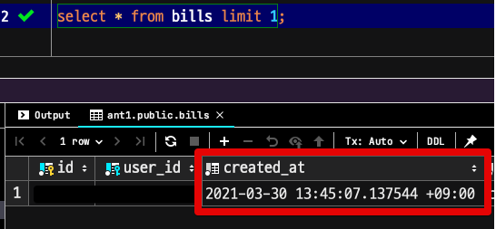

# PostgreSQL 데이터 Client에서 KST로 확인하기 (feat. DataGrip)

PostgreSQL에서는 보편적으로 UTC로 시간 데이터를 저장후, 애플리케이션 / Gui Client에서의 타임존에 맞춰 노출시키는 방식을 선택하는데요. 

> 해당 컬럼의 타입이 `timestamp with time zone` 로 되어있어야만 합니다.

Client Timezone에 따라 자동 전환이 되다보니 서버 애플리케이션에서 접속 하게 되면 UTC가 KST로 잘 전환이되어 노출 되는데요.  
반면에 DB Gui Client로 접근할 경우 Client Timezone을 기본값으로 세팅하면 KST 전환이 안되는데요.  
    
그래서 JetBrains사의 데이터 전문 도구인 DataGrip 혹은 IntelliJ의 Database Client에서 Client Timezone을 설정하는 방법을 소개드립니다.

## as-is

먼저 현재 기본설정으로 되어있는 DB에서 시간값을 확인해보겠습니다.

```sql
select now();
```

그럼 아래와 같이 UTC로 `now()` 가 노출되는 것을 볼 수 있습니다.


(현재 한국 시간은 2021-04-24 10:19:06 입니다.)  
  
실제 적재된 테이블의 컬럼값을 확인해도 아래와 같이 **UTC** 값 그대로 노출되는 것을 볼 수 있습니다.


현재 UTC 데이터 그대로 노출되는게 확인되었으니 이젠 Gui 도구를 설정해보겠습니다.

## 설정

당연한 얘기지만, 해당 시간 컬럼의 값은 `timestamp with time zone` 여야만 합니다.  
(대부분 이걸 사용하시겠지만)  
  


DataGrip에서는 `해당 DataSource 설정` -> `Options` -> `Time zone` 항목으로 이동하여 `Asia/Seoul` 을 등록하시면됩니다.


## to-be

그럼 이제 **다시 Query Console**을 열어서 쿼리를 실행해봅니다.  
(다시 열지않으면, 이전 세션이 유지되어 KST 적용이 안됩니다.)


테이블의 데이터까지 정상적으로 KST가 적용된 것을 확인할 수 있습니다.

