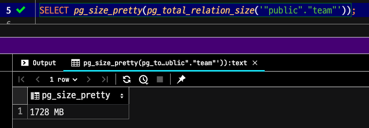
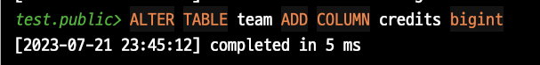

# PostgreSQL Online DDL

Aurora MySQL 5.7까지만 써본 경험에서 Online DDL 은 여전히 부담스럽다.  
그럼에도 수억건의 테이블에 DDL을 수행하는 것은 언제나 서비스 운영시에 필요한 사항이다.

사내의 PostgreSQL DB를 10에서 11로 업그레이드하면서 `Alter Table`에 대한 부담이 많이 줄었다.


데이터가 많은 만큼 시간소요 예측도 힘들고 만약 작업이 실패하는 경우 rollback 작업에 따른 위험도도 크기 때문입니다.

> 백업데이터로 테스트를 진행하지만 막상 라이브 환경에서는 시간소요가 더 오래 걸리는 경우도 많음

Aurora PostgreSQL에서는 약 200G 테이블에 인덱스, 컬럼 추가를 해본 결과 100G만 넘어도 인덱스 생성에 1시간이 넘는 Aurora MySQL과는 다르게 40여 분 만에 인덱스가 생성되었습니다! 컬럼 추가는 바로 되네요

PostgreSQL의 online ddl 컬럼 추가는 meta data를 저장하는 시스템 카탈로그에 추가된 정보만 반영하기 때문에 아주 빠른 작업이 가능합니다.


Craig Ringer가 언급 했듯이 PostgreSQL은 오래 전부터 잠금 없이 일부 ALTER 작업을 지원하기 시작했습니다.

그러나 버전 11 ALTER TABLE ... ADD COLUMN ... DEFAULT ... NOT NULL 에서는 테이블 재작성(및 긴 잠금)도 방지하므로 마이그레이션에 안전하게 사용할 수 있습니다.

## Alter Table

오래전부터 PostgreSQL은 테이블의 스키마를 변경하는 것이지만, 최신 데이터베이스는 이 작업을 거의 즉시 수행할 수 있을 만큼 충분히 정교합니다. 테이블의 기존 표현을 다시 작성하는 대신(따라서 기존의 모든 데이터를 막대한 비용을 들여 복사해야 함), 새 열에 대한 정보가 시스템 카탈로그에 추가되므로 비용이 저렴합니다. 따라서 새 열에 대한 값으로 새 행을 작성할 수 있으며, 시스템은 이전에 값이 없었던 현재 행에 대해 NULL을 반환할 수 있을 만큼 똑똑합니다.

### 성능비교

```sql
CREATE TABLE team AS
SELECT team_no, team_no % 100 AS department_no
FROM generate_series(1, 10000000) AS team_no;
```

- 5천만건

```sql
SELECT pg_size_pretty(pg_total_relation_size('"public"."team"'));
```



**alter table**

```sql
ALTER TABLE team ADD COLUMN credits bigint;
```



**alter table with default value**

```sql
ALTER TABLE team ADD COLUMN credits2 bigint NOT NULL DEFAULT 0;
```


#### PostgreSQL 10

#### PostgreSQL 11

#### PostgreSQL 12

#### PostgreSQL 13
## Alter Table with Default Value

[PostgreSQL 11의 릴리즈 노트](https://www.postgresql.org/docs/11/release-11.html) 를 보면 **Alter Table에 기본값이 포함되어도 빠르게 생성할 수 있다**는 내용이 나온다.

> Many other useful performance improvements, including the ability to avoid a table rewrite for ALTER TABLE ... ADD COLUMN with a non-null column default


## 정리

지금까지 열을 추가할 때 실수로 테이블에 대한 액세스를 잠그는 것은 새로운 Postgres 운영자에게 흔한 함정이었습니다. 왜냐하면 SQL에 DEFAULT 절을 추가하는 데 드는 추가 비용을 알려주는 내용이 없었기 때문입니다. 이를 알아내려면 매뉴얼을 자세히 읽거나 사소한 운영 사고를 겪으면서 얻은 지혜가 필요합니다.

### 필요에 의해 완화된 제약 조건

DEFAULT 열을 저렴하게 추가할 수 없기 때문에 NOT NULL로 설정된 열을 추가하는 것도 불가능합니다. 정의상 NOT NULL 열은 모든 행에 대해 값을 가져야 하며, 기존 데이터에 어떤 값을 가져야 하는지 지정하지 않고 비어 있지 않은 테이블에 열을 추가할 수 없으므로 DEFAULT를 사용해야 합니다.

먼저 null 가능으로 추가하고 마이그레이션을 실행하여 기존의 모든 행에 값을 추가한 다음 SET NOT NULL로 테이블을 변경하여 비어 있지 않은 열을 얻을 수 있지만, 이 경우에도 모든 기존 데이터에서 새 제약 조건을 확인하므로 완전히 안정적인 스캔이 필요하므로 완벽하게 안전하다고 할 수는 없습니다. 이 스캔은 재작성보다 빠르지만 여전히 액세스 독점 잠금이 필요합니다.

대규모 관계에 널이 아닌 새로운 열을 가져오는 데 많은 노력이 필요하기 때문에 실제로는 이 작업을 수행하지 않는 경우가 많습니다. 너무 위험하거나 시간이 너무 많이 걸리기 때문입니다.

### 그럼에도 불구하고 왜 null이 아닌 열을 사용해야 할까요?

문서 저장소, 키/값 저장소 및 기타 덜 정교한 저장 기술보다 관계형 데이터베이스를 선호하는 가장 큰 이유 중 하나는 데이터 무결성입니다. 열은 INT, DECIMAL 또는 TIMESTAMPTZ와 같은 강력한 타입으로 입력됩니다. 값은 NOT NULL, VARCHAR(길이) 또는 CHECK 제약 조건으로 제약됩니다. 외래 키 제약 조건은 참조 무결성을 보장합니다.

스키마 설계가 잘 되어 있으면 데이터베이스가 이를 보장하기 때문에 데이터의 품질이 높은 상태임을 확신할 수 있습니다. 이렇게 하면 쿼리 또는 변경이 더 쉬워지고, 예기치 않은 상태의 데이터로 인해 발생하는 애플리케이션 수준의 버그 전체를 방지할 수 있습니다. 저와 같은 애호가들은 항상 강력한 데이터 제약 조건에 찬성해 왔지만, 대규모로 실행되는 Postgres에서는 새로운 null이 아닌 필드를 만들 수 없는 경우가 많다는 사실도 알고 있었습니다.

Postgres 11에서는 필요에 따라 기존 행에 대해서만 기본값을 마샬링하여 기본값이 있는 열 추가를 빠르게 수행할 수 있는 변경 사항이 도입되었습니다. 비용이 많이 드는 테이블 재작성 및 액세스 독점의 장기 보류가 제거되어 Postgres 운영 스토리의 빈틈이 메워졌습니다. 이제 강력한 데이터 무결성과 강력한 운영 보장을 모두 확보할 수 있게 됩니다.
## 참고

- https://tool.lu/en_US/article/3j3/preview
- https://brandur.org/postgres-default