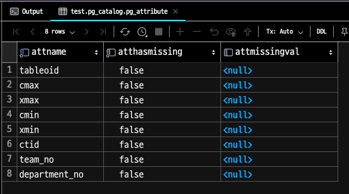
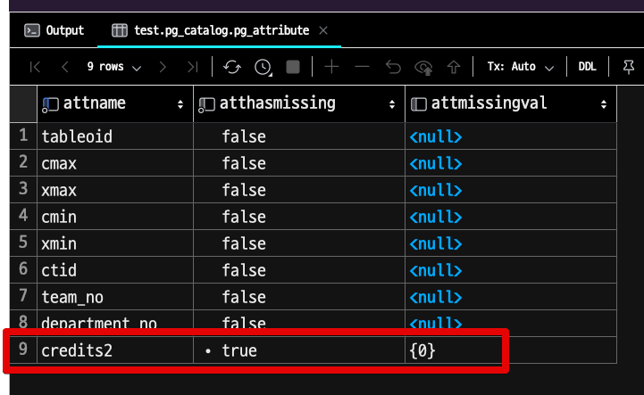
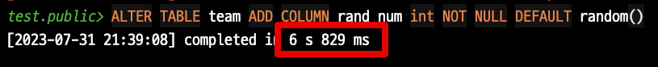
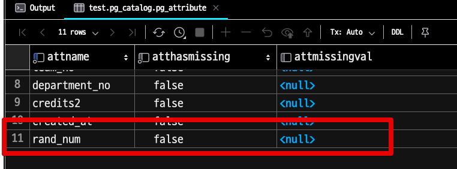
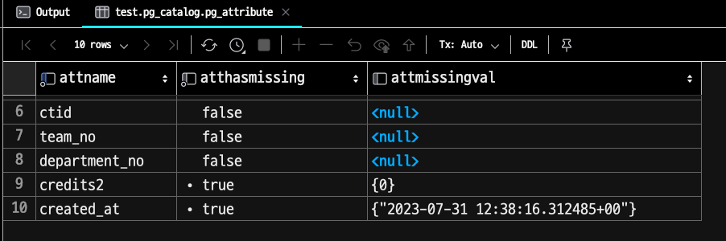
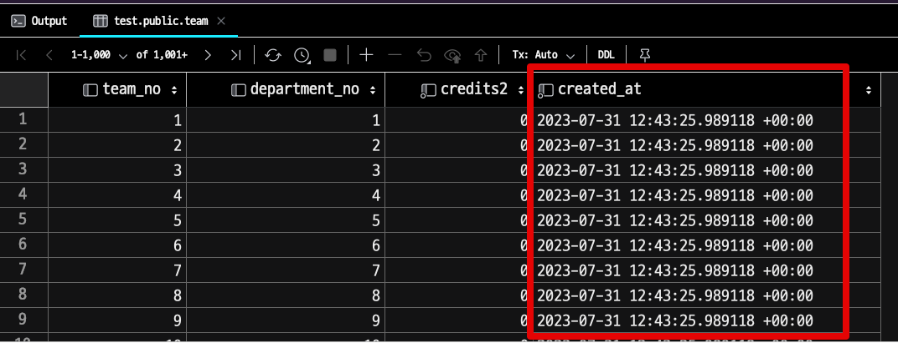

# PostgreSQL Online DDL

Aurora MySQL 5.7까지만 써본 경험에서 Online DDL 은 여전히 부담스럽다.  
그럼에도 대량의 데이터가 쌓인 테이블에 DDL을 수row하는 것은 서비스를 운영하다보면 피할 수 없다.  
  
100GB 이상의 테이블에 Online DDL로 컬럼을 추가해도 1시간이 넘도록 수row되던 경험을 해보면 가능한 기존 테이블에 컬럼을 추가하는 등의 DDL 작업은 피하고 싶어진다.    

다만, MySQL과 다르게 PostgreSQL에서는 오래 전부터 **일부 ALTER 작업에 대해서는 잠금 없는 변경**이 가능하다.  

이는 MySQL에서는 **테이블 구조를 변경할때 전체 테이블의 데이터를 새로운 구조로 복사하는 방식**을 취해서 테이블의 크기가 큰 경우 오래 걸리는 것과 다르게 PostgreSQL에서는 테이블 구조 변경 작업시 **meta data를 저장하는 시스템 카탈로그에 추가된 정보만 반영한다**.  
즉, 테이블 데이터를 새로 복사하지 않고 메타데이터만 업데이트 하기 때문에 테이블의 크기와 관계 없이 빠른 작업이 가능하다.  

> 물론 여기에 더하여 PostgreSQL에서는 Alter Table은 트랜잭션을 지원해서 변경사항을 롤백할 수 있다거나 MVCC로 인해 테이블 변경 작업에도 테이블 읽기가 차단되지 않는 동시성 등의 장점이 존재한다.

여기에 더해 PG 11 버전 부터는 `default value` & `Not Null` 값을 포함한 컬럼 추가에서도 성능 개선이 있었다.
  
이번 시간에는 `alter table` 과 `alter table with defaul value` 를 각각 10, 11버전에서를 비교해본다.

## 1. 성능 비교

개인 PC에 Docker를 통해 PG 10, 11을 각각 수row한다.

- 2020 M1 Mac Mini
- 16GB Memory

테스트할 테이블은 다음과 같이 **1천만건**을 생성해둔다.

```sql
CREATE TABLE team AS
SELECT team_no, team_no % 100 AS department_no
FROM generate_series(1, 10000000) AS team_no;
```

테이블의 크기는 1.7GB이다.

```sql
SELECT pg_size_pretty(pg_total_relation_size('"public"."team"'));
```


각 버전별로 이제 테스트를 해보자.
### PG 10

**alter table**

```sql
ALTER TABLE team ADD COLUMN credits bigint;
```


**5ms**로 즉시 적용되었다.  
이번엔 `not null & default value` 을 포함해서 진row해본다.

**alter table with not null & default value**

```sql
ALTER TABLE team ADD COLUMN credits2 bigint NOT NULL DEFAULT 0;
```

그럼 다음과 같이 **3.5초**가 걸린다.


ms로 변환하면 3,500ms 인데, 단순 `alter table` 과 비교하면 **700배**의 성능 차이가 발생했다.  
  
이는 PostgreSQL 이 실제로 전체 테이블을 다시 작성하여 각 row에 열을 추가하고 기본값으로 채우기 때문이다.
  
반면에 11버전에서는 어떻게 될까?

### PG 11

[PostgreSQL 11의 릴리즈 노트](https://www.postgresql.org/docs/11/release-11.html) 를 보면 **Alter Table에 기본값과 non null 옵션을 포함해서 컬럼을 추가하는 작업의 성능이 개선**되었다는 내용이 나온다.

> Many other useful performance improvements, including the ability to avoid a table rewrite for ALTER TABLE ... ADD COLUMN with a non-null column default

실제로 그런지 한번 확인해보자.  
  
**alter table**


당연하지만 일반적인 컬럼 추가는 **4ms**로 즉시 적용되었다.  
  
본론인 `not null & default value` 을 포함해서 진row해본다.  
  
**alter table with not null & default value**


**not null & default value**가 포함되었음에도 4ms로 일반적인 컬럼추가와 비슷한 성능이 도출되었다.  
  
왜 그런걸까?

## 2. PostgreSQL 11 에서의 성능 개선

이전에는 PostgreSQL에서 새로운 컬럼을 추가하고 해당 컬럼에 `non-null default` 을 설정하려면 전체 테이블을 재작성해야 했다.  
이는 모든 row에 대해 새로운 컬럼 값을 저장해야 했기 때문이다.  
이런 방식은 엄청나게 많은 row 를 가진 테이블에서는 많은 시간, 많은 공간 (복제 공간)이 필요한 동시에 테이블에 대한 액세스를 제한할 수 있다.  
  
그러나 PostgreSQL 11에서는 이를 개선했다.    
새 컬럼이 추가될 때 **기본값이 즉시 모든 row에 적용되는 대신, 이 값은 메타데이터로 저장되며 실제 데이터는 필요에 따라 실시간으로 생성**된다.  
즉, **각 row가 처음으로 새 컬럼을 액세스하면 기본값이 생성되고 저장**된다.

이 방식의 장점은 새로운 컬럼을 추가하는 동작이 즉시 완료되고, 실제 데이터의 채우는 과정이 백그라운드에서 점진적으로 이루어지며, 이로 인해 테이블 잠금 시간을 크게 줄일 수 있다는 것이다.

이와 관련해서 PostgreSQL 11의 - [커밋](https://git.postgresql.org/gitweb/?p=postgresql.git;a=commitdiff;h=16828d5c0273b4fe5f10f42588005f16b415b2d8) 내용을 살펴 보면 다음과 같은 이야기가 있다.  

This patch removes the need for the rewrite as long as the
default value is not volatile. The default expression is evaluated at
the time of the ALTER TABLE and the result stored in a new column
(attmissingval) in pg_attribute, and a new column (atthasmissing) is set
to true. Any existing row when fetched will be supplied with the
attmissingval. New rows will have the supplied value or the default and
so will never need the attmissingval.

Any time the table is rewritten all the atthasmissing and attmissingval
settings for the attributes are cleared, as they are no longer needed.

The most visible code change from this is in heap_attisnull, which
acquires a third TupleDesc argument, allowing it to detect a missing
value if there is one. In many cases where it is known that there will
not be any (e.g.  catalog relations) NULL can be passed for this
argument.

이를 번역 겸 한번 실제로 검증해보자.

PostgreSQL 데이터베이스의 모든 열에 대한 정보를 추적하는 시스템 테이블인 `pg_attribute` 에 두 개의 새로운 필드를 추가되었다.

- `atthasmissing`
  - `attmissingval` 이 설정되었는지 여부 (설정되었으면 `true`)
  - 만약 이 컬럼이 `true` 로 설정되면, 이는 해당 속성이 기본값을 가지며, 이 값이 `attmissingval` 에 저장되어 있음을 의미
- `attmissingval`
  - 특정 테이블의 특정 컬럼에 기본값을 설정할 때 사용 
  - `ALTER TABLE ... ADD COLUMN` 명령을 실행할 때, 기본 표현식이 평가되고 그 결과가 `attmissingval` 에 저장된다.
  - 즉, 이 컬럼은 row 가 처음 생성될 때 누락될 수 있는 기본값을 저장합니다.

```sql
SELECT attname, atthasmissing, attmissingval
FROM pg_attribute
WHERE attrelid = 'team'::regclass;
```



여기서 위 실험처럼 기본값을 가진 신규 컬럼을 추가하면 

```sql
ALTER TABLE team ADD COLUMN credits2 bigint NOT NULL DEFAULT 0;
```

다음과 같이 `atthasmissing` 는 `true`, `attmissingval` 는 `0` 을 가진다.



스캔은 row을 반환하면서 이 새로운 필드를 확인하고, 필요한 곳에 누락된 값을 반환한다.  
테이블에 새로 삽입된 row들은 생성될 때 기본값을 가져와서, 그들의 내용을 반환할 때 `atthasmissing` 을 확인할 필요가 없게 된다.

이 최적화는 기본값과 비휘발성 함수 호출에만 작동한다.  
random()과 같은 변동 함수를 사용해보자. 

```sql
ALTER TABLE team ADD COLUMN rand_num int NOT NULL DEFAULT random();
```

그럼 아래와 같이 10버전과 동일하게 전체 row의 값들이 재생성 된다. 



그리고 `atthasmissing` 역시 설정되지 않는다.



반면에 비휘발성 함수 호출은 잘 작동한다.  
예를 들어, `DEFAULT now()` 를 추가하면 

```sql
ALTER TABLE team ADD COLUMN created_at timestamp with time zone NOT NULL DEFAULT now();
```

트랜잭션의 현재 `now()` 값이 `atthasmissing` 에 들어가서 모든 기존 row이 이를 상속하게 된다. 





새로 삽입된 row은 예상대로 현재 `now()` 값이 된다.


## 마무리

문서 저장소, 키/값 저장소 및 기타 덜 정교한 저장 기술보다 관계형 데이터베이스를 선호하는 가장 큰 이유 중 하나는 데이터 무결성이다. 열은 INT, DECIMAL 또는 TIMESTAMPTZ와 같은 강력한 타입으로 입력된다. 값은 NOT NULL, VARCHAR(길이) 또는 CHECK 제약 조건으로 제약된다. 외래 키 제약 조건은 참조 무결성을 보장한다.

스키마 설계가 잘 되어 있으면 데이터베이스가 이를 보장하기 때문에 데이터의 품질이 높은 상태임을 확신할 수 있다. 이렇게 하면 쿼리 또는 변경이 더 쉬워지고, 예기치 않은 상태의 데이터로 인해 발생하는 애플리케이션 수준의 버그 전체를 방지할 수 있다. 저와 같은 애호가들은 항상 강력한 데이터 제약 조건에 찬성해 왔지만, 대규모로 실row되는 Postgres에서는 새로운 null이 아닌 필드를 만들 수 없는 경우가 많다는 사실도 알고 있었다.


## 참고

- https://tool.lu/en_US/article/3j3/preview
- https://brandur.org/postgres-default