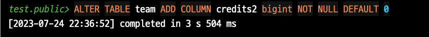

# PostgreSQL Online DDL

Aurora MySQL 5.7까지만 써본 경험에서 Online DDL 은 여전히 부담스럽다.  
그럼에도 대량의 데이터가 쌓인 테이블에 DDL을 수행하는 것은 서비스를 운영하다보면 피할 수 없다.  
  
100GB 이상의 테이블에 Online DDL로 컬럼을 추가해도 1시간이 넘도록 수행되던 경험을 해보면 가능한 기존 테이블에 컬럼을 추가하는 등의 DDL 작업은 피하고 싶어진다.    

다만, MySQL과 다르게 PostgreSQL에서는 오래 전부터 **일부 ALTER 작업에 대해서는 잠금 없는 변경**이 가능하다.  

이는 MySQL에서는 **테이블 구조를 변경할때 전체 테이블의 데이터를 새로운 구조로 복사하는 방식**을 취해서 테이블의 크기가 큰 경우 오래 걸리는 것과 다르게 PostgreSQL에서는 테이블 구조 변경 작업시 **meta data를 저장하는 시스템 카탈로그에 추가된 정보만 반영한다**.  
즉, 테이블 데이터를 새로 복사하지 않고 메타데이터만 업데이트 하기 때문에 테이블의 크기와 관계 없이 빠른 작업이 가능하다.  

> 물론 여기에 더하여 PostgreSQL에서는 Alter Table은 트랜잭션을 지원해서 변경사항을 롤백할 수 있다거나 MVCC로 인해 테이블 변경 작업에도 테이블 읽기가 차단되지 않는 동시성 등의 장점이 존재한다.

여기에 더해 PG 11 버전 부터는 `default value` & `Not Null` 값을 포함한 컬럼 추가에서도 성능 개선이 있었다.
  
이번 시간에는 `alter table` 과 `alter table with defaul value` 를 각각 10, 11버전에서를 비교해본다.

## 1. 성능 비교

개인 PC에 Docker를 통해 PG 10, 11을 각각 수행한다.

- 2020 M1 Mac Mini
- 16GB Memory

테스트할 테이블은 다음과 같이 **1천만건**을 생성해둔다.

```sql
CREATE TABLE team AS
SELECT team_no, team_no % 100 AS department_no
FROM generate_series(1, 10000000) AS team_no;
```

테이블의 크기는 1.7GB이다.

```sql
SELECT pg_size_pretty(pg_total_relation_size('"public"."team"'));
```


각 버전별로 이제 테스트를 해보자.
### PG 10

**alter table**

```sql
ALTER TABLE team ADD COLUMN credits bigint;
```


**5ms**로 즉시 적용되었다.  
이번엔 `not null & default value` 을 포함해서 진행해본다.

**alter table with not null & default value**

```sql
ALTER TABLE team ADD COLUMN credits2 bigint NOT NULL DEFAULT 0;
```

그럼 다음과 같이 **3.5초**가 걸린다.



ms로 변환하면 3,500ms 인데, 단순 `alter table` 과 비교하면 **700배**의 성능 차이가 발생했다.  
  
반면에 11버전에서는 어떻게 될까?
### PG 11

[PostgreSQL 11의 릴리즈 노트](https://www.postgresql.org/docs/11/release-11.html) 를 보면 **Alter Table에 기본값과 non null 옵션을 포함해서 컬럼을 추가하는 작업의 성능이 개선**되었다는 내용이 나온다.

> Many other useful performance improvements, including the ability to avoid a table rewrite for ALTER TABLE ... ADD COLUMN with a non-null column default

실제로 그런지 한번 확인해보자.  
  
**alter table**


당연하지만 일반적인 컬럼 추가는 **4ms**로 즉시 적용되었다.  
  
본론인 `not null & default value` 을 포함해서 진행해본다.  
  
**alter table with not null & default value**


**not null & default value**가 포함되었음에도 4ms로 일반적인 컬럼추가와 비슷한 성능이 도출되었다.  
  
왜 그런걸까?

## 2. PG 11 에서의 성능 개선

Postgres 11에서는 필요에 따라 기존 행에 대해서만 기본값을 마샬링하여 기본값이 있는 열 추가를 빠르게 수행할 수 있는 변경 사항이 도입되었다.  
비용이 많이 드는 테이블 재작성 및 액세스 독점의 장기 보류가 제거되어 Postgres 운영 스토리의 빈틈이 메워졌다.  
이제 강력한 데이터 무결성과 강력한 운영 보장을 모두 확보할 수 있게 된다.

이전에는 PostgreSQL에서 새로운 컬럼을 추가하고 해당 컬럼에 non-null 기본값을 설정하려면 전체 테이블을 재작성해야 했다. 이는 모든 행에 대해 새로운 컬럼 값을 저장해야 했기 때문입니다. 이런 방식은 매우 큰 테이블에 대해 시간 소모적이고, 공간을 많이 사용하며, 동시에 테이블에 대한 액세스를 제한할 수 있다.

그러나 PostgreSQL 11에서는 이를 개선하기 위한 방법을 도입했다. 새 컬럼이 추가될 때 기본값이 즉시 모든 행에 적용되는 대신, 이 값은 메타데이터로 저장되며 실제 데이터는 필요에 따라 "on the fly"로 생성된다. 즉, 각 행이 처음으로 새 컬럼을 액세스하면 기본값이 실제로 생성되고 저장된다.

이 방식의 장점은 새로운 컬럼을 추가하는 동작이 즉시 완료되고, 실제 데이터의 채우는 과정이 배경에서 점진적으로 이루어지며, 이로 인해 테이블 잠금 시간을 크게 줄일 수 있다는 것입니다.

이러한 개선은 대량의 데이터를 처리하는 데이터베이스에서 매우 중요합니다. 다만, 이 기능이 모든 상황에서 이상적이라는 것은 아닙니다. 만약 데이터의 일관성이 중요한 경우에는 이전 방식을 사용하여 즉시 모든 행에 대한 기본값을 설정할 수 있다.


지금까지 열을 추가할 때 실수로 테이블에 대한 액세스를 잠그는 것은 새로운 Postgres 운영자에게 흔한 함정이었다. 왜냐하면 SQL에 DEFAULT 절을 추가하는 데 드는 추가 비용을 알려주는 내용이 없었기 때문이다. 이를 알아내려면 매뉴얼을 자세히 읽거나 사소한 운영 사고를 겪으면서 얻은 지혜가 필요한다.

DEFAULT 열을 저렴하게 추가할 수 없기 때문에 NOT NULL로 설정된 열을 추가하는 것도 불가능한다.  
정의상 NOT NULL 열은 모든 행에 대해 값을 가져야 하며, 기존 데이터에 어떤 값을 가져야 하는지 지정하지 않고 비어 있지 않은 테이블에 열을 추가할 수 없으므로 DEFAULT를 사용해야 한다.

먼저 null 가능으로 추가하고 마이그레이션을 실행하여 기존의 모든 행에 값을 추가한 다음 SET NOT NULL로 테이블을 변경하여 비어 있지 않은 열을 얻을 수 있지만, 이 경우에도 모든 기존 데이터에서 새 제약 조건을 확인하므로 완전히 안정적인 스캔이 필요하므로 완벽하게 안전하다고 할 수는 없다.  
이 스캔은 재작성보다 빠르지만 여전히 액세스 독점 잠금이 필요한다.

대규모 관계에 널이 아닌 새로운 열을 가져오는 데 많은 노력이 필요하기 때문에 실제로는 이 작업을 수행하지 않는 경우가 많다. 너무 위험하거나 시간이 너무 많이 걸리기 때문이다.


## 번외 - not null 선언이 필요할까?

문서 저장소, 키/값 저장소 및 기타 덜 정교한 저장 기술보다 관계형 데이터베이스를 선호하는 가장 큰 이유 중 하나는 데이터 무결성이다. 열은 INT, DECIMAL 또는 TIMESTAMPTZ와 같은 강력한 타입으로 입력된다. 값은 NOT NULL, VARCHAR(길이) 또는 CHECK 제약 조건으로 제약된다. 외래 키 제약 조건은 참조 무결성을 보장한다.

스키마 설계가 잘 되어 있으면 데이터베이스가 이를 보장하기 때문에 데이터의 품질이 높은 상태임을 확신할 수 있다. 이렇게 하면 쿼리 또는 변경이 더 쉬워지고, 예기치 않은 상태의 데이터로 인해 발생하는 애플리케이션 수준의 버그 전체를 방지할 수 있다. 저와 같은 애호가들은 항상 강력한 데이터 제약 조건에 찬성해 왔지만, 대규모로 실행되는 Postgres에서는 새로운 null이 아닌 필드를 만들 수 없는 경우가 많다는 사실도 알고 있었다.


## 참고

- https://tool.lu/en_US/article/3j3/preview
- https://brandur.org/postgres-default