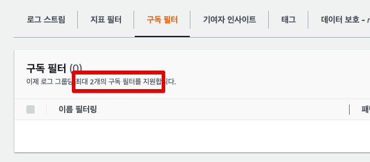
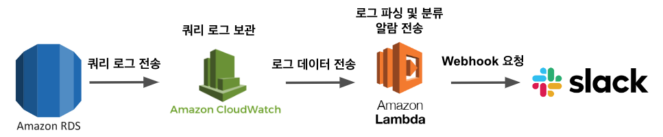

# AWS RDS PostgreSQL에서 Slow, Error, DDL 쿼리 발생시 Slack 발송하기

[이전 글](https://jojoldu.tistory.com/570) 에서 RDS에서 Slow Query가 발생했을때 Slack을 발송하는 것을 구현했다.  
이번 시간에는 해당 코드를 발전시켜서 **Slow, Error, DDL 쿼리들을 각각의 채널에 발송**시키도록 Lambda 코드를 개선한다.

> 여기에서는 기본적인 Node.js 사용법 정도는 알고 있다는 것을 전재로 한다.
> 전체 코드는 [Github](https://github.com/jojoldu/lambda-in-action/tree/master/rds-logs-one-slack) 에 있다.

## 1. 구조

가능하면 AWS Lambda는 **각각 하나의 기능만 담당**하도록 구성하고 싶었다.  
하지만 CloudWatach의 로그 스트림에서는 **구독 필터를 2개밖에 할당하지 못한다**.  



즉, Slow, Error, DDL 등 종류별로 Lambda를 만들어서 구독을 시킬 수가 없다.  
그래서 하나의 Lambda에서 로그 종류를 구분해서 각각 Slack 채널에 전송하도록 구성해야한다.  

물론 **하나의 Lambda가 Gateway가 되어 각각의 Lambda를 호출하도록 구성**할 수도 있다.  
다만, 그렇게되면 Lambda와 Lambda 사이에 메세지 유실이 되지 않기 위해 SQS와 같은 메세지큐를 도입해야하는데, 그렇게까지 확장해서 하는 것은 회사 규모에 따라 과하다.  
단일 Lambda에서 구축하면 Lambda 사이에서의 메세지 유실 걱정을 하지 않으면서도 빠르게 구축 가능하다.  
  
그래서 현재 팀 규모가 크지 않을때를 위해 다음과 같이 간단한 구조로 진행한다.




## 2. CloudWatch Stream 구성

```
[w1, w2, w3!="*DETAIL*", w4!="*connection*" && w4!="*disconnection*" && w4!="*configuration file*" && w4!="*changed to*" && w4!="*cannot be changed*" && w4!="*setsockopt(TCP_KEEPIDLE) failed*"]
```

```
"LOG" "duration"
```

```js
import https from 'https';
import zlib from 'zlib';

export const WEB_HOOKS = {
  DDL: process.env.DDL,
  SLOW: process.env.SLOW,
  ERROR: process.env.ERROR,
};

export const TIME_OUT = 3;

export const handler = async (event, context) => {
  zlib.gunzip(Buffer.from(event.awslogs.data, 'base64'), async (e, result) => {
    if (e) {
      context.fail(e);
    }

    console.log('EVENT: \n' + JSON.stringify(event, null, 2));
    const { logEvents, logStream } = JSON.parse(result);

    try {
      const { success, fail } = await sendMessages(logEvents, logStream);

      if (fail > 0) {
        throw new Error('Slack 발송 실패');
      }

      console.log(`[Response] 성공: ${success} 건`);
    } catch (e) {
      console.log('slack message fail:', e);
      context.fail(e);
    }
  });
};

export async function sendMessages(logEvents, logStream) {
  const messages = logEvents
    ?.map((event) => new Message(event, logStream))
    .filter((message) => message.isSendable);

  console.log(`sendMessages count=${messages.length}`);

  const results = await Promise.allSettled(
    messages.map(async (message) => {
      await send(slackMessage(message), message.webhook);
    }),
  );

  results
    .filter((result) => result.status === 'rejected')
    .map((fail) => console.log(`sendMessage 실패: ${fail.value}`));

  return {
    success: results.filter((result) => result.status === 'fulfilled').length,
    fail: results.filter((result) => result.status === 'rejected').length,
  };
}

export class Message {
  constructor({ message, timestamp }, logStream) {
    this._message = message;
    this.currentTime = new KstTime(timestamp).time;
    this.logLocation = logStream;
    this.userIp = this.getUserIp(message);
    this.user = this.getUser(message);
    this.pid = this.getPid(message);
    this.queryTime = this.getQueryTime(message);
    this.query = this.getQuery(message);
  }

  getQuery(message) {
    const match = message.match(/(?:ERROR|LOG|STATEMENT):\s+(.*)$/);

    if (!match) {
      return '';
    }

    return match[1]
      .replace('execute <unnamed>: ', '')
      .replace(/^duration:\s+\d+\.\d+\s+ms\s+/, '')
      .replace('statement: ', '');
  }

  getPid(message) {
    const match = message.match(/:\[\d+]/)[0];

    return match ? match.slice(2, -1) : '';
  }

  getUser(message) {
    const match = message.match(/:\w+@\w+:/);

    return match ? match[0].slice(1, -1) : '';
  }

  getUserIp(message) {
    const match = message.match(/\d{1,3}\.\d{1,3}\.\d{1,3}\.\d{1,3}/);

    return match ? match[0] : '';
  }

  getQueryTime(message) {
    const match = message.match(/duration: \d+\.\d+ ms/);

    if (!match || match.length === 0) {
      return 0;
    }

    return (Number(match[0].match(/\d+\.\d+/)[0]) / 1000).toFixed(3);
  }

  get type() {
    if (
      this.query.includes('create table') ||
      this.query.includes('drop table') ||
      this.query.includes('alter table')
    ) {
      return 'DDL';
    }

    return this._message.match(/ERROR:\s+(?:.*:\s+)?(.+)/) ? 'ERROR' : 'SLOW';
  }

  get isSendable() {
    if (
      this._message.includes('Query Text:') ||
      this.user.includes('datadog') ||
      !this.user
    ) {
      return false;
    }

    if (this.type !== 'SLOW') {
      return true;
    }

    return this.queryTime >= TIME_OUT;
  }
  get webhook() {
    if (this.type === 'DDL') {
      return WEB_HOOKS.DDL;
    }

    if (this.type === 'ERROR') {
      return WEB_HOOKS.ERROR;
    }

    return WEB_HOOKS.SLOW;
  }
}

export class KstTime {
  /**
   * @param timestamp {number}
   */
  constructor(timestamp) {
    const kst = new Date(timestamp + 32400000);
    this.time = `${kst.getFullYear().toString()}-${this.pad(
      kst.getMonth() + 1,
    )}-${this.pad(kst.getDate())} ${this.pad(kst.getHours())}:${this.pad(
      kst.getMinutes(),
    )}:${this.pad(kst.getSeconds())}`;
  }

  pad(n) {
    return n < 10 ? '0' + n : n;
  }
}

/** @param message {Message} */
export function slackMessage(message) {
  const title = `[${message.type} 쿼리]`;
  const payload = `언제: ${message.currentTime}\n로그위치: ${message.logLocation}\n사용자: ${message.user}\n사용자IP: ${message.userIp}\npid: ${message.pid}\n수행시간: ${message.queryTime} 초\n쿼리/메세지: ${message.query}`;

  const color = message.type === 'DDL' ? '#2eb886' : '#FF0000';

  return {
    attachments: [
      {
        color: color,
        title: title,
        fields: [
          {
            value: payload,
            short: false,
          },
        ],
      },
    ],
  };
}

export async function send(message, webhook) {
  const { host, pathname } = new URL(webhook);
  const options = {
    hostname: host,
    path: pathname,
    method: 'POST',
    timeout: 10000,
    headers: {
      'Content-Type': 'application/json',
    },
  };

  return request(options, message)
    .then(() => {
      console.log(`[Slack 발송 성공] message=${JSON.stringify(message)}`);
    })
    .catch((e) => {
      console.log(
        `[Slack 발송 실패] message=${JSON.stringify(
          message,
        )}, webhook=${webhook}`,
        e,
      );
      throw e;
    });
}

export async function request(options, data) {
  return new Promise((resolve, reject) => {
    const req = https.request(options, (res) => {
      res.setEncoding('utf8');
      let rawData = '';

      res.on('data', (chunk) => {
        rawData += chunk;
      });

      res.on('end', () => {
        try {
          resolve(rawData);
        } catch (err) {
          console.log(`res.on(end) Error`, err);
          reject(err);
        }
      });
    });

    req.on('error', (err) => {
      reject(err);
    });

    req.write(JSON.stringify(data));
    req.end();
  });
}
```

## 테스트 코드

