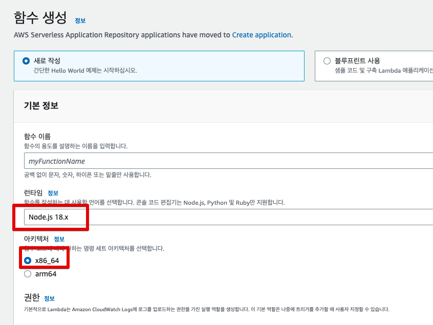
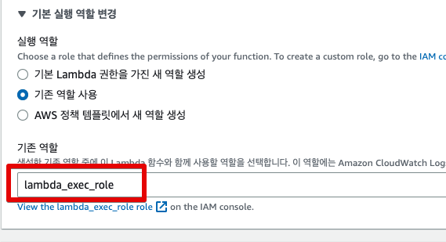
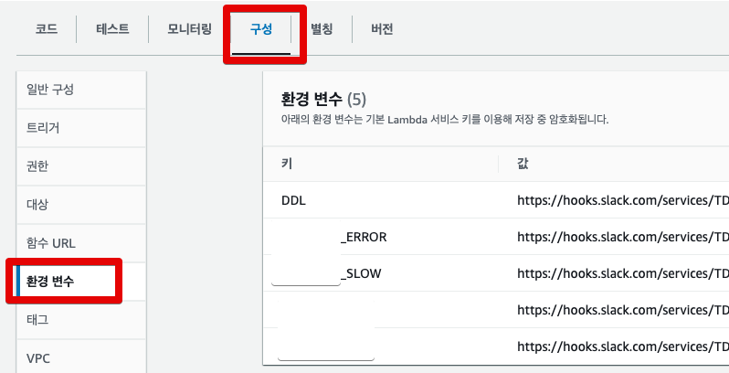
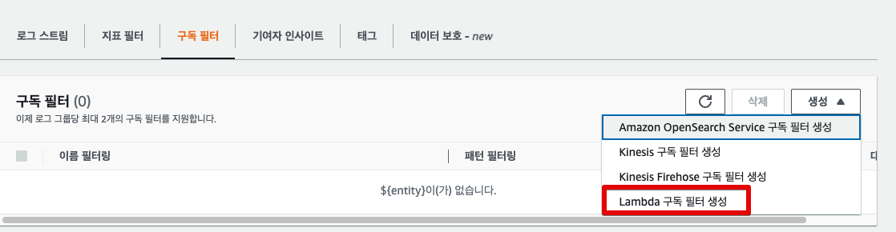
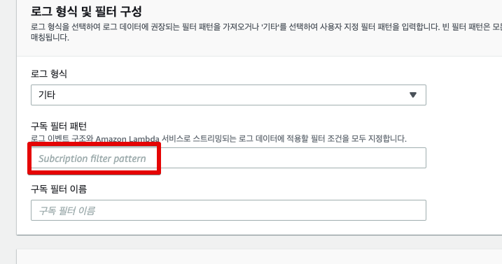
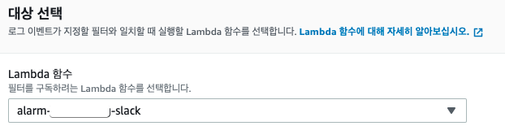
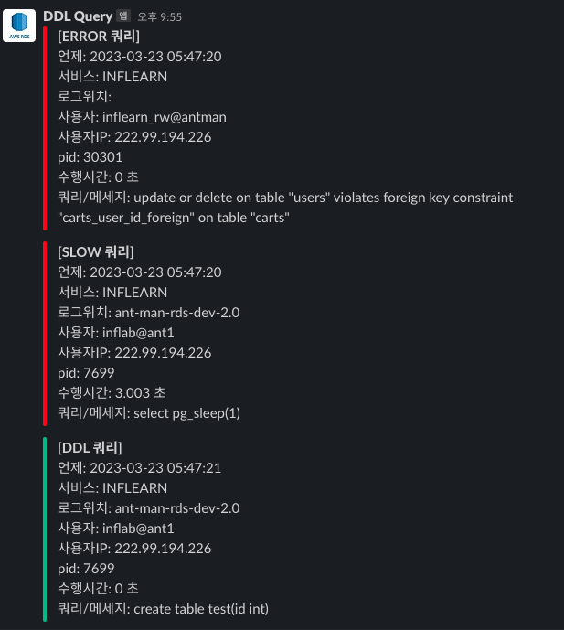

# AWS RDS PostgreSQL에서 Slow, Error, DDL 쿼리 발생시 Slack 발송하기

[이전 글](https://jojoldu.tistory.com/570) 에서 RDS에서 Slow Query가 발생했을때 Slack을 발송하는 것을 구현했다.  
이번 시간에는 해당 코드를 발전시켜서 **Slow, Error, DDL 쿼리들을 각각의 채널에 발송**시키도록 Lambda 코드를 개선해보자.

> 이후에 이 코드는 [Serverless](https://www.serverless.com/) 등의 프레임워크로 교체될 예정이다.

## 1. 구조

가능하면 AWS Lambda는 **각각 하나의 기능만 담당**하도록 구성하고 싶었다.  
하지만 CloudWatach의 로그 스트림에서는 **구독 필터를 2개밖에 할당하지 못한다**.  


즉, Slow, Error, DDL 등 종류별로 Lambda를 만들어서 구독을 시킬 수가 없다.  
그래서 **하나의 Lambda에서 로그 종류를 구분해서 각각 Slack 채널에 전송**하도록 구성해야한다.  

물론 **하나의 Lambda가 Gateway가 되어 각각의 Lambda를 호출하도록 구성**할 수도 있다.  
다만, 그렇게되면 Lambda와 Lambda 사이에 메세지 유실이 되지 않기 위해 SQS와 같은 메세지큐를 도입해야하는데, 그렇게까지 확장해서 하는 것은 회사 규모에 따라 과하다.  
단일 Lambda에서 구축하면 Lambda 사이에서의 메세지 유실 걱정을 하지 않으면서도 빠르게 구축 가능하다.  
  
그래서 현재 팀 규모가 크지 않을때를 위해 다음과 같이 간단한 구조로 진행한다.


좀 더 제대로 구현하고자 한다면 메세지큐 등을 도입해도 된다.

## 2. Lambda 함수 생성

Lambda 코드는 가장 무난한 Node.js 로 진행한다 (2023.04 현재 18.x 버전을 Lambda 에서 쓸 수 있다.)  
  
AWS Lambda와 CloudWatch 로그를 연동하는 방법은 [이전 글](https://jojoldu.tistory.com/570) 에서 자세히 설명하고 있어서, 이 글에서는 주요 변경 부분들만 소개한다.

> 전체 코드는 [Github](https://github.com/jojoldu/lambda-in-action/tree/master/rds-logs-one-slack) 에 있다.

### 2-1. 함수 배포

AWS Lambda 페이지로 이동하여 함수를 생성한다.



팀에서 이미 사용중인 Lambda Role이 있다면 해당 Role을 선택하고 없다면 기본 Role을 선택한다.



생성된 함수에서 가장 먼저 해야할 일은 **환경 변수**를 설정하는 것이다.  
  
해당 환경 변수는 **Query 로그 종류에 따라 다르게 수신 받을 슬랙 채널의 웹훅**을 등록한다.  



이 글에서는 총 3개의 채널이 존재한다.

- DDL
- SLOW
- ERROR

이 변수에 따라 각각의 채널 웹훅을 등록한다.  

> 슬랙 채널의 웹훅을 등록하는 방법은 [이 글](https://jojoldu.tistory.com/552)을 참고하면 된다.

이렇게 만들어진 환경 변수를 사용하여 알람을 보낼 Lambda 함수의 전체 코드는 다음과 같다.

```js
import https from 'https';
import zlib from 'zlib';

export const WEB_HOOKS = {
  DDL: process.env.DDL,
  SLOW: process.env.SLOW,
  ERROR: process.env.ERROR,
};

export const TIME_OUT = 3;

export const handler = async (event, context) => {
  zlib.gunzip(Buffer.from(event.awslogs.data, 'base64'), async (e, result) => {
    if (e) {
      context.fail(e);
    }

    console.log('EVENT: \n' + JSON.stringify(event, null, 2));
    const { logEvents, logStream } = JSON.parse(result);

    try {
      const { success, fail } = await sendMessages(logEvents, logStream);

      if (fail > 0) {
        throw new Error('Slack 발송 실패');
      }

      console.log(`[Response] 성공: ${success} 건`);
    } catch (e) {
      console.log('slack message fail:', e);
      context.fail(e);
    }
  });
};

export async function sendMessages(logEvents, logStream) {
  const messages = logEvents
    ?.map((event) => new Message(event, logStream))
    .filter((message) => message.isSendable);

  console.log(`sendMessages count=${messages.length}`);

  const results = await Promise.allSettled(
    messages.map(async (message) => {
      await send(slackMessage(message), message.webhook);
    }),
  );

  results
    .filter((result) => result.status === 'rejected')
    .map((fail) => console.log(`sendMessage 실패: ${fail.value}`));

  return {
    success: results.filter((result) => result.status === 'fulfilled').length,
    fail: results.filter((result) => result.status === 'rejected').length,
  };
}

export class Message {
  constructor({ message, timestamp }, logStream) {
    this._message = message;
    this.currentTime = new KstTime(timestamp).time;
    this.logLocation = logStream;
    this.userIp = this.getUserIp(message);
    this.user = this.getUser(message);
    this.pid = this.getPid(message);
    this.queryTime = this.getQueryTime(message);
    this.query = this.getQuery(message);
  }

  getQuery(message) {
    const match = message.match(/(?:ERROR|LOG|STATEMENT):\s+(.*)$/);

    if (!match) {
      return '';
    }

    return match[1]
      .replace('00000: ', '')
      .replace('execute <unnamed>: ', '')
      .replace(/^duration:\s+\d+\.\d+\s+ms\s+/, '')
      .replace('statement: ', '');
  }

  getPid(message) {
    const match = message.match(/:\[\d+]/)[0];

    return match ? match.slice(2, -1) : '';
  }

  getUser(message) {
    const match = message.match(/:\w+@\w+:/);

    return match ? match[0].slice(1, -1) : '';
  }

  getUserIp(message) {
    const match = message.match(/\d{1,3}\.\d{1,3}\.\d{1,3}\.\d{1,3}/);

    return match ? match[0] : '';
  }

  getQueryTime(message) {
    const match = message.match(/duration: \d+\.\d+ ms/);

    if (!match || match.length === 0) {
      return 0;
    }

    return (Number(match[0].match(/\d+\.\d+/)[0]) / 1000).toFixed(3);
  }

  get type() {
    if (
      this.query.includes('create table') ||
      this.query.includes('drop table') ||
      this.query.includes('alter table')
    ) {
      return 'DDL';
    }

    return this._message.match(/ERROR:\s+(?:.*:\s+)?(.+)/) ? 'ERROR' : 'SLOW';
  }

  get isSendable() {
    if (
      this._message.includes('Query Text:') ||
      this.user.includes('datadog') ||
      !this.user
    ) {
      return false;
    }

    if (this.type !== 'SLOW') {
      return true;
    }

    return this.queryTime >= TIME_OUT;
  }
  get webhook() {
    if (this.type === 'DDL') {
      return WEB_HOOKS.DDL;
    }

    if (this.type === 'ERROR') {
      return WEB_HOOKS.ERROR;
    }

    return WEB_HOOKS.SLOW;
  }
}

export class KstTime {
  /**
   * @param timestamp {number}
   */
  constructor(timestamp) {
    const kst = new Date(timestamp + 32400000);
    this.time = `${kst.getFullYear().toString()}-${this.pad(
      kst.getMonth() + 1,
    )}-${this.pad(kst.getDate())} ${this.pad(kst.getHours())}:${this.pad(
      kst.getMinutes(),
    )}:${this.pad(kst.getSeconds())}`;
  }

  pad(n) {
    return n < 10 ? '0' + n : n;
  }
}

/** @param message {Message} */
export function slackMessage(message) {
  const title = `[${message.type} 쿼리]`;
  const payload = `언제: ${message.currentTime}\n로그위치: ${message.logLocation}\n사용자: ${message.user}\n사용자IP: ${message.userIp}\npid: ${message.pid}\n수행시간: ${message.queryTime} 초\n쿼리/메세지: ${message.query}`;

  const color = message.type === 'DDL' ? '#2eb886' : '#FF0000';

  return {
    attachments: [
      {
        color: color,
        title: title,
        fields: [
          {
            value: payload,
            short: false,
          },
        ],
      },
    ],
  };
}

export async function send(message, webhook) {
  const { host, pathname } = new URL(webhook);
  const options = {
    hostname: host,
    path: pathname,
    method: 'POST',
    timeout: 10000,
    headers: {
      'Content-Type': 'application/json',
    },
  };

  return request(options, message)
    .then(() => {
      console.log(`[Slack 발송 성공] message=${JSON.stringify(message)}`);
    })
    .catch((e) => {
      console.log(
        `[Slack 발송 실패] message=${JSON.stringify(
          message,
        )}, webhook=${webhook}`,
        e,
      );
      throw e;
    });
}

export async function request(options, data) {
  return new Promise((resolve, reject) => {
    const req = https.request(options, (res) => {
      res.setEncoding('utf8');
      let rawData = '';

      res.on('data', (chunk) => {
        rawData += chunk;
      });

      res.on('end', () => {
        try {
          resolve(rawData);
        } catch (err) {
          console.log(`res.on(end) Error`, err);
          reject(err);
        }
      });
    });

    req.on('error', (err) => {
      reject(err);
    });

    req.write(JSON.stringify(data));
    req.end();
  });
}

```

각각의 function들은 다음과 같은 역할을 한다.

- `WEB_HOOKS`
  - 각 SQL 들의 종류에 따라 Slack Webhook가 다를 수 있기 때문에 각 종류에 맞는 Slack 채널을 Lambda 환경변수에서 관리하고 이를 코드에서 사용한다.
- `sendMessages`
  - 로그들의 최종 변환 객체인 `Message` 들을 Slack으로 보내는 Main 함수
- `Message`
  - 로그데이터를 파싱하여 Slack에 보내고자 하는 메세지 객체로 만드는 클래스
- `KstTime`
  - UTC 시간 데이터를 식별가능한 KST 시간 객체로 변환하는 클래스
- `slackMessage`
  - 전달받은 `Message` 객체를 Slack 으로 보낼 수 있는 형태로 변환하는 함수
- `send` 
  - `request`를 이용해 Slack Webhook에 메세지를 전송한다.
- `request`
  - callback만 지원하는 https 모듈을 async/await를 사용할 수 있도록 Promise 객체로 반환


해당 함수를 Lambda 테스트로 테스트를 해본다.  

> 자세한 테스트 방법은 [기존 글](https://jojoldu.tistory.com/570#2-1-lambda-%ED%95%A8%EC%88%98-%EC%83%9D%EC%84%B1)을 참고해본다.
### 2-2. 테스트 코드
  
> 이 부분은 필요하면 진행하고, 필요 없다면 굳이 진행할 필요는 없다.

Lambda의 테스트로 함수를 검증하기에는 시간이 너무 소요된다고 생각할 수 있다.    
빠르게 각각의 함수들을 테스트 하기 위해서 실제 로컬 프로젝트에서 Jest로 각 함수들을 검증해보는 것도 좋다.  
  
아래는 위에서 만든 Lambda 함수를 간단하게 Jest로 검증하기 위한 테스트 코드이다.

> 전체 코드는 [Github](https://github.com/jojoldu/lambda-in-action/tree/master/rds-logs-one-slack) 에 있다.
  
**test/data.js**

```js
export const event_slow = {
  "timestamp": 1679485640000,
  "message": "2023-03-22 11:47:20 UTC:222.99.194.226(49157):test@inflab:[7699]:LOG:  duration: 3003.040 ms  execute <unnamed>: select pg_sleep(1)",
};
export const event_ddl = {
  "timestamp": 1679485640000,
  "message": "2023-03-23 06:08:23 UTC:222.99.194.226(50564):test@inflab:[9437]:LOG:  execute <unnamed>: create table test(id int)",
};

export const event_explain = {
  "timestamp": 1679485640000,
  "message": "2023-03-22 11:47:20 UTC:222.99.194.226(49157):test@inflab:[7699]:LOG:  duration: 3003.029 ms  plan:\n\tQuery Text: select pg_sleep(1)\n\tResult  (cost=0.00..0.01 rows=1 width=4)",
};
export const event_error = {
  "timestamp": 1679485640000,
  "message": '2023-03-22 08:46:36 UTC:222.99.194.226(60346):test@antman:[30301]:ERROR:  update or delete on table "users" violates foreign key constraint "carts_user_id_foreign" on table "carts"',
};
```

이 테스트 데이터를 가지고 각 함수들을 검증해본다.

**test/app.spec.js**

```js
import {
  data,
  event_ddl,
  event_error,
  event_explain,
  event_slow,
} from './data';
import { Message } from '../app-one';

describe('rds-logs-slack', () => {

  it('duration이 초로 변환된다', () => {
    const result = new Message(event_slow, '').queryTime;

    expect(result).toBe('3.003');
  });

  it('IP가 추출된다', () => {
    const result = new Message(event_slow, '').userIp;

    expect(result).toBe('222.99.194.226');
  });

  it('PID가 추출된다', () => {
    const result = new Message(event_slow, '').pid;

    expect(result).toBe('7699');
  });

  it('user가 추출된다', () => {
    const result = new Message(event_slow, '').user;

    expect(result).toBe('test@inflab');
  });


  it('slow Query가 추출된다', () => {
    const result = new Message(event_slow, '').query;

    expect(result).toBe('select pg_sleep(1)');
  });

  describe('Error Query', () => {
    it('dot(.)이 있는 쿼리', () => {
      const message =
        '2023-03-25 13:58:16 UTC:10.0.0.43(59886):test@antman:[27123]:ERROR:  invalid input syntax for type integer: "3010.17"';

      const result = new Message(
        {
          message,
          timestamp: 1679485640000,
        },
        '',
      ).query;

      expect(result).toBe('invalid input syntax for type integer: "3010.17"');
    });

    it('일반 쿼리', () => {
      const result = new Message(event_error, '').query;

      expect(result).toBe(
        'update or delete on table "users" violates foreign key constraint "carts_user_id_foreign" on table "carts"',
      );
    });
  });

  it('error type이 추출된다', () => {
    const result = new Message(event_error, '').type;

    expect(result).toBe('ERROR');
  });

  it('slow type이 추출된다', () => {
    const result = new Message(event_slow, '').type;

    expect(result).toBe('SLOW');
  });

  it('ddl type이 추출된다', () => {
    const result = new Message(event_ddl, '').type;

    expect(result).toBe('DDL');
  });

  it('3초이상이면 전송 가능하다', () => {
    const result = new Message(event_slow, '').isSendable;

    expect(result).toBe(true);
  });

  it('ERROR이면 전송 가능하다', () => {
    const result = new Message(event_error, '').isSendable;

    expect(result).toBe(true);
  });

  it('DDL이면 전송 가능하다', () => {
    const result = new Message(event_ddl, '').isSendable;

    expect(result).toBe(true);
  });

  it('explain이면 전송하지 않는다', () => {
    const result = new Message(event_explain, '').isSendable;

    expect(result).toBe(false);
  });
});
```

각 기능들이 정상작동하는 것도 확인이 되었다면, Lambda 함수를 생성 완료한다.
## 3. CloudWatch Stream 구성

만들어진 Lambda와 연동하기 위해 로그 필터를 구성해보자.  
RDS의 CloudWatch 로 이동하여 Lambda 구독 필터를 생성한다.



다른 것은 기존대로 작성해도 무방하나, 필터 패턴은 **본인의 RDS 로그 패턴에 맞게** 사용한다.



아래 항목은 각종 RDS 알람에서는 받고 싶지 않은 내용들을 필터링 한 것이다.

```
[w1, w2, w3!="*DETAIL*", w4!="*connection*" && w4!="*disconnection*" && w4!="*configuration file*" && w4!="*changed to*" && w4!="*cannot be changed*" && w4!="*setsockopt(TCP_KEEPIDLE) failed*"]
```

이대로 사용해도 무방하나, 본인 시스템의 로그에서 받고 싶은것들이 무엇인지 패턴 테스트를 해보고 등록한다.  
  
로그 필터 패턴에서는 **몇 초이상의 쿼리를 걸러내는건 하지 않는다**.  
패턴만으로 몇초이상인지 구분하기가 쉽지 않고,  
슬로우 쿼리의 기준은 시스템이 고도화될수록 점점 낮아지기 때문이다.  
(처음엔 5초였다가, 쿼리가 개선될수록 4초, 3초, 2초이상이면 SlowQuery로 판단하는 등)  
  
모든 로그를 Lambda가 받아서 필요한 것만 보내도 되지만, 이렇게 되면 Lambda 비용이 너무 급증하기 때문에 가능하면 알람 대상이 아닌 로그들은 구독 필터에서 걸러주는 것이 좋다.  
  
패턴 등록 후, 위에서 만들었던 Lambda 함수를 선택한다.



## 4. 최종 점검

모든 설정이 끝났다.
Slow, Error, DDL 쿼리들을 실행해본다.
그럼 아래와 같이 각 지정된 슬랙 채널에 정식 알람이 오는 것을 확인할 수 있다.


