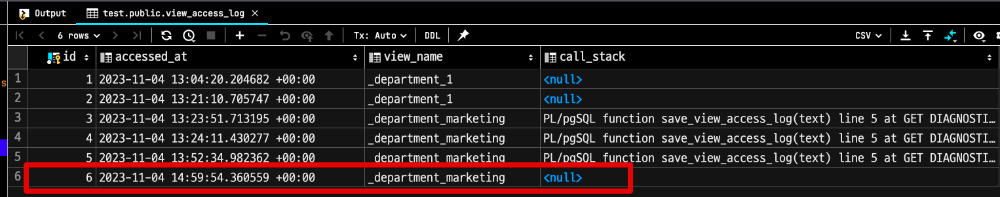

# PostgreSQL 에서 애플리케이션 변경 없이 모든 View 의 접근 기록 테이블에 적재하기

View Table을 적극적으로 사용하는 시스템에서 View Table의 의존성을 줄이고자 할때가 있다.  
이는 레거시 데이터베이스를 리팩토링 해야하는 경우인데, 보통 너무나 파편화된 데이터베이스 접근을 하나로 통합하고자 할때이다.  
보통 ORM을 사용하는 경우에는 이러한 리팩토링이 쉽지만, ORM을 사용하지 않는 경우에는 어떻게 해야할까?  
  
가장 먼저 해야할 것은 **View가 계속 사용되고 있는지, 리팩토링에서 누락은 없었는지**를 확인할 수 있는 방법을 마련하는 것이다.  
  
특정 테이블의 변경이 있을때마다 어떠한 액션을 넣을 수 있는 가장 흔한 방법은 [Trigger](https://www.postgresql.org/docs/current/sql-createtrigger.html) 이다.
하지만 아쉽게도 PostgreSQL에서는 View Table의 Select 쿼리에 대한 Trigger가 적용되진 않는다.

그래서 다른 방법을 고려해야 한다.  
이 글에서는 **View Table 을 조회할때마다 로그를 남기는 방법**을 소개한다.

## 테스트 환경 구성

먼저 아래와 같이 테스트 환경을 구성할 예정이다.  

- postgres:14 (Docker)

테스트에 사용할 스키마는 다음과 같다.

```sql
CREATE TABLE users AS
SELECT user_no, user_no % 1000 as department_no, now() as created_at
FROM generate_series(1, 50000) AS user_no;
```

그리고 다음과 같이 View Table을 생성한다.  
이 View는 **기존 서비스의 레거시 View로 가정**한다.

```sql
CREATE OR REPLACE VIEW public._department_marketing AS
SELECT *
FROM public.users
WHERE department_no = 100;
```

이제 이 View Table (`_department_marketing`) 에 접근할때마다 로그를 남기는 방법을 알아보자.

## 해결 방법

먼저 다음과 같이 접근 기록을 남길 테이블을 생성한다.

```sql
CREATE TABLE view_access_log (
     id bigserial PRIMARY KEY ,
     accessed_at timestamp WITH TIME ZONE DEFAULT NOW(),
     view_name   varchar(255),
     call_stack  text
);
```

그리고 다음과 같이 접근 로그를 남길 함수를 생성한다.

```sql
CREATE OR REPLACE FUNCTION save_view_access_log(view_str text) RETURNS integer
    LANGUAGE plpgsql
AS
$$
DECLARE
    s_stack text; -- 변수 선언만, 이후 콜스택이 필요하면 추가로 함수를 수정한다.
BEGIN
    INSERT INTO public.view_access_log (view_name, call_stack) VALUES(view_str, s_stack);
    RETURN 1;
END
$$;
```

- `view_str`: 파라미터로 뷰의 이름을 입력받는다.
- `s_stack` : 현재 콜 스택을 저장하는 변수이나 여기서는 초기화하지 않고 선언만 한다.
- `INSERT ~~` : view_access_log 테이블에 새 로그를 적재한다. 

그리고 View 가 조회될때마다 이 함수를 호출하도록 다음과 같이 **대체용 View** 를 생성한다.

```sql
CREATE OR REPLACE VIEW _department_marketing_temp AS
    WITH qry AS MATERIALIZED (SELECT save_view_access_log('_department_marketing') AS logged)
SELECT vw.* FROM _department_marketing vw, qry;
```

기존 View인 `_department_marketing` 의 결과를 `_department_marketing_temp` 를 호출할때도 동일하게 반환하도록 하고, 동시에 `save_view_access_log` 함수를 호출한다.

- 공통 테이블 표현식 (CTE)인 qry를 사용한다. 
  - 이 CTE는 MATERIALIZED 키워드를 사용하여 실행 결과를 임시로 저장한다.
- CTE 내에서 `save_view_access_log` 함수를 호출하여 `_department_marketing` 뷰에 접근 로그를 기록한다. 
- `SELECT vw.*` 
  - 기존 `_department_marketing` 뷰의 모든 컬럼을 선택한다.
- `FROM _department_marketing vw, qry` 
  - `_department_marketing` 뷰(vw로 별칭)와 qry CTE를 조인한다. 
  - `qry.logged > 0` 조건을 명시하지 않았기 때문에 **logged의 값에 상관없이 항상 _department_marketing 뷰의 내용을 반환**한다.


여기까지만 적용되면 **대체용 View를 호출하면 기존 View의 결과를 반환하면서 테이블에 접근 로그가 적재**된다.  
원하는 것은 **기존의 레거시 View를 접근할때 기록을 남기는 것**이기 때문에, **대체용 View와 기존 View의 이름을 서로 변경한다**.

```sql
ALTER VIEW _department_marketing RENAME TO _department_marketing_old;
ALTER VIEW _department_marketing_temp RENAME TO _department_marketing;
```

즉, 기존의 View는 `_department_marketing_old` 이름으로 변경되고, 대체용 View는 **기존 View의 이름**으로 변경되었다.  
이렇게 되면 애플리케이션 등 View의 이름으로 호출하는 곳에서는 모두 **이름이 변경된 대체용 View를 호출**하게 되니 접근 기록이 계속 적재된다.  

기존 View를 수정하는 방법도 있겠지만, 그럴 경우 **기존 View에 선언된 복잡한 스키마를 가져와야한다**.  
개발자의 실수로 오타가 들어가는 등의 문제가 발생할 수 있기 때문에, 기존 선언된 View는 그대로 두고 이를 불러오기만 하도록 구성하였다.  
  
## 검증

실제로 접근 기록이 잘 적재되는지 확인해본다.

```sql 
select count(*) from _department_marketing;
```

그럼 다음과 같이 `view_access_log` 테이블에 데이터가 잘 적재된 것을 확인할 수 있다.



## 마무리

오래된 레거시 시스템을 다루다보면 View, Table을 리팩토링할때마다 애플리케이션 구조를 과하게 가져가야할 때가 많다.  
이 글에서의 방법은 애플리케이션 복잡도를 높이지 않으면서, 사후 처리도 간편한 (Function과 View만 제거하면 됨) 방법이다.  
레거시 데이터베이스를 리팩토링 할 때 한번 사용해봐도 좋을것 같다.
