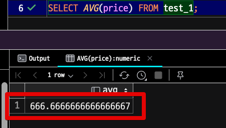
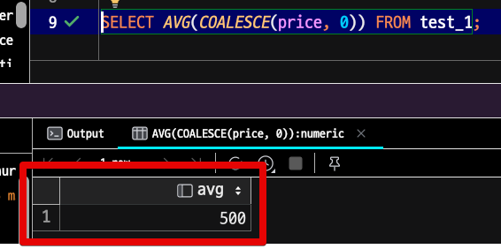

# 숫자와 boolean은 항상 Not Null로 선언한다.

데이터베이스 테이블의 Boolean과 숫자 타입 컬럼을 nullable로 설정하면 여러 문제가 발생할 수 있습니다:

일관성: 컬럼을 nullable로 설정하면 값이 null일 수 있으므로, 데이터의 일관성이 떨어질 수 있습니다. 특히 Boolean 컬럼의 경우, 값이 True, False, Null 세 가지 상태가 될 수 있어, 이 컬럼의 의미를 해석하는데 혼란을 줄 수 있습니다.

성능: Null 값은 인덱스를 생성하는데 문제를 일으킬 수 있으며, 특히 대용량 데이터베이스에서는 성능 저하를 일으킬 수 있습니다. 이는 Null 값을 가진 로우를 처리하는 데 추가적인 처리 시간이 필요하기 때문입니다.

```sql
SELECT * FROM users WHERE is_active IS FALSE OR is_active IS NULL;
```

질의 결과 혼란: Null은 '값이 없음' 또는 '알 수 없음'을 의미합니다. 때문에 이를 고려하지 않고 SQL 질의를 작성하면 예상치 못한 결과를 얻을 수 있습니다. 예를 들어, 숫자 타입의 컬럼이 Null 값을 허용하고 이 컬럼에 대해 평균 값을 계산하려고 하면, Null 값이 있는 로우는 계산에서 제외됩니다.

```sql
insert into test_1 (price) values (1000);
insert into test_1 (price) values (null);
insert into test_1 (price) values (1000);
insert into test_1 (price) values (0);
```

이 상태에서 평균값을 구한다면 어떻게 될까?



PostgreSQL에서 AVG() 함수를 사용하여 평균을 계산할 때, NULL 값은 자동으로 무시됩니다. 즉, NULL은 계산에 포함되지 않습니다.  
NULL 값을 포함하여 평균을 계산하려면, NULL 값을 특정 값으로 바꾸는 함수인 COALESCE()를 사용해야 한다.




애플리케이션 로직 복잡성: 컬럼이 Null 값을 허용하면, 이 컬럼을 사용하는 애플리케이션 코드에서 Null 체크를 항상 수행해야 합니다. 이는 코드의 복잡성을 증가시킬 수 있습니다.

따라서 특별한 이유가 없다면, 가능하면 컬럼을 NOT NULL로 설정하는 것이 좋습니다. 이렇게 하면 데이터의 일관성을 유지하고, 성능을 최적화하며, 질의 결과 혼란을 줄이고, 애플리케이션 코드의 복잡성을 줄일 수 있습니다.

숫자
- null과 0의 차이가 명확한가?

Boolean
- null과 false의 차이가 명확한가?

둘의 구분이 명확하지 않다면 무조건 Not Null로 하여 기본값을 보장해야한다.

이에 대해서는 **ORM 을 사용한다면** **객체 생성 단계에서 무조건 기본값을 할당**하도록 해야한다.

그렇지 않으면 숫자 연산에 대해 0인 상태와 NULL인 상태 모두에 대해 항상 조건을 걸거나 NULL → 0 변경을 수행해야만 하게 된다.  
또한 boolean도 상태가 true/false/null 세가지 상태가 되어 버린다.

물론 정말로 null과 0의 차이가 명확하게 구분이 필요한 상황이라면 이에 대해 정확하게 주석을 남겨야 하며, 이 주석의 범위는 테이블 컬럼 주석과 ORM 영역 모두에 해당한다.